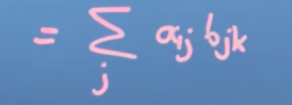
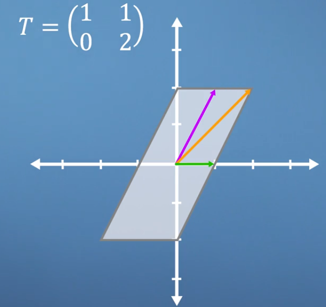

---


---

[TOC]

# Problems that can be solved via linear algebra

## 1. Simultaneous equations

I bought two apples and thee bananas for eight dollars, the i bought ten apples and one banana for 13 dollars. What is the cost of one banana and one apple?

```math
SIMULTANEOUS EQUATIONS

2a + 3b = 8
10a + 1b = 13
```


* It's useful to have a computer algorithm that solves that in the general case


We got coefficients `2, 3, 10, 1`, input variables `a, b` and output `8, 13`

This can be written as matrix and vector operations:

$$\begin{pmatrix} 2, 3 \\ 3, 4\end{pmatrix} * \begin{bmatrix} a \\ b\end{bmatrix} = \begin{bmatrix} 8 \\ 13\end{bmatrix}$$


## 2. Fit a equation to data


How to pick best parameters that will generate a curve that best describes the histogram's data?

# Vectors


Find the equation

* The equation will have two parameters, the center of the distribution ($\mu$) and how wide it is ($\sigma$) 


**Equation:** normal or Gaussian distribution


**How to guess $\mu$ and $\sigma$**


Use the over-fits and under-fits to say how good the values are. Plot the variables and measure the difference between the goodness and badness.


> In the center we got the point of best possible fit - a parameter space. Changing $\mu$ or $\sigma$ can get us near this point

If i do move a little bit in some direction, my results get better? This movement can be imagined as a vector that changes  the variables.


Knowing the direction to aim will end the search for the best parameters earlier

With vectors and calculus we can make little moves towards the center, finding the best possible fit. 

**Downhill** problems


# Vectors carry information

A vector is a list, a list can carry all information about something. A car for example:


With three parameters we can imagine a landscape map, finding the answer to what are the best values for this parameters (minimizing them) would seem like walking trough this landscape towards the bottom of the hills to find the lowest point in this landscape.

# More concepts on vectors


* **Length** or **size**
* **Dot** product or inner scalar **projection product**


Independently of the coordinate system used, a vector has two properties: its **size** and **direction**


If the coordinate system consists in two orthogonal unit vectors:


The hat denotes size one


**from Pythagoras**


# Dot product - multiplying two vectors together


## Properties

### Commutative

$r \cdot s = s \cdot r$

The way of the dot product doesn't changes the result

### **Distributive** over addition

$ r \cdot (s + t) = r \cdot s + r \cdot t $


### **Associativity** over multiplication

$r \cdot (a*S) = a (r \cdot s)$

$a$ is a scalar


**Derived properties**


This gives you the size of the vector


# Cosine dot product

On school math


On vector notation


> The **dot product** gets the size of the two vectors and multiplies by the cosine of the angle between them - it tells us something about the extent to which the two vector got in the same direction


## Projection


# Changing basis


### How to represent $r$ in terms of $b_1$ and $b_2$?

* **IF the angle between the unit vectors of the new base is $90°$ (ORTHOGONAL to each other)**
  * Then the projection or dot product can be used to do the transformation
  * Using the orthogonal representation makes computations much easier and faster


**If the new basis vector aren't orthogonal, the dot product can't be used for changing from one basis to another, matrices and matrix operations will be used instead**


# Basis, vector space and linear independence

###  Basis

* A base is a set of $n$ vectors that
  * Are not linear combinations of each other (**linearly independent**)
    * I can't write any of them using a combination of the other ones
  * Span the space they describe
    * The space is then *n-dimensional*

**linearly independent**


It must be impossible to sum two vectors and get the third


In linear algebra, the space can't be warped or folded, all transformations to one base from another keeps the vector space being a regularly spaced grid.


The vector rules will hold if the grid is always regularly spaced - things can be stretched, sheared, inverted or rotated, but linear combinations still work.


# Basis change applications 😮🤯

1. We got a set of 2D data points


2. The points can be more or less described by a line (linear regression ;) 


3. Now we can imagine mapping the data from the $x,y$ plane onto the line, the new $x$ would be how far the line goes and the new $y$ would indicate the distance from the points to the line, in other words, the noisiness of the data.


4. The noise dimension tells how good the fit is.


5. Both coordinate system uses orthogonal basis vectors, the dot-product can be used to map the points between them - projecting from x, y to line, noisiness


> A neural network that identifies faces, for example, could apply some transformation to the pixel data, putting it into a new basis that describes the nose shape, skin hue, eye distance - the real work of the neural network will be to somehow derive a set of basis vector that extract the most information-rich features of faces


A neural network could identify a face by deriving the best features from an image, creating basis vectors that extracts the most rich features of the faces.


https://www.youtube.com/watch?v=LyGKycYT2v0

<iframe width="1908" height="807" src="https://www.youtube.com/embed/LyGKycYT2v0" frameborder="0" allow="accelerometer; autoplay; encrypted-media; gyroscope; picture-in-picture" allowfullscreen></iframe>
# Matrices, vectors and solving simultaneous equations


## Price discovery


The following equation


$$2a + 3b = 8$$

$$10a + 1b = 13$$


Can be represented as


$$\begin{pmatrix} 2, 3 \\ 10, 1\end{pmatrix}  \begin{bmatrix} a \\ b\end{bmatrix} = \begin{bmatrix} 8 \\ 13\end{bmatrix}$$


$$\begin{pmatrix} 2a + 3b \\ 10a + 1b\end{pmatrix} = \begin{bmatrix} 8 \\ 13\end{bmatrix}$$


# How matrices transform space

* The grid stays evenly spaced for any transformation
* The origin doesn't move
* The vector sum still works on the transformed space


> We can think about matrix multiplication as just being the **multiplication** of the **vector sum** of the **transformed basis vectors**
>
> The transformation tell us to where the **basis vector** goes


# Types of matrix transformation


https://www.geogebra.org/m/dcnBMXhN


## Identity matrix

Multiplying by the basis vectors doesn't change the vector - this is called the **identity matrix**, represented by $I$


## Changing the diagonal values

### Positive case

The basis vectors get bigger or smaller - space gets scaled


The unit square can be a square or a rectangle


### Fractions

The basis vectors would get squished


### Negative case


The basis vectors will flip to the other side


**Inverting both axis**


That is called an **inversion**

### Mirroring


$$A_2(A_1(r))$$


* $A_1$ is a $90 \deg$ rotation counterclockwise
  * 

* $A_2$ is a vertical mirror
  * 


The result is


To solve it without needing to draw


# Gaussian Elimination


**Inverse matrix**: given a matrix $A$, its inverse ($A^{-1}$) is the matrix that when multiplied by $A$ gives the **identity matrix** ($I$) as the result

## Apples and Bananas problem


1. Multiplying an matrix by its inverse gives the identity matrix as the result
2. The identity matrix is the matrix that does not change the vector $r$
3. Multiplying both sides of the equation by the inverse, we can change
   1. $A^{-1}A = I$
   2. $I$ can be simply removed, since it does not change the result
4. Then, finding the inverse of $A$, can lead us to the result


It's easier to solve this specific problem just by substitutions. A more complex problem:


This problem can be solved via a process of elimination by subtracting the first row from the other ones


The matrix is **triangular**: everything below the body diagonal is zero = "*Echelon Form*"


Then, the problem can be solved by subtracting rows from each other and substituting the rows with known answers until the answer is found


**We didn't need to compute the inverse, but, we solved this problem only yo this specific output $s$ ($A \cdot r = s$) - CALCULATING THE INVERSE MATRIX WE COULD SOLVE IT TO ANY $s$**

   


In solving this problem we end up with the identity matrix

# From Gaussian elimination to the inverse matrix


Can be solved by elimination and back substitution for each column of $B$ - **but it can be done to all rows at the same time**


Subtracting from the first row


Multiplying the third row by $-1$ 


Substituting by the last row - note that we are multiplying by $3$ to get $0$ on the first row


# Determinant and inverses


**General case**


**For a 2 x 2**


----


* Both basis vectors are points in the same line
* They are multiples
* They aren't linearly independent

 

**The determinant is $0$** - because the area is zero

$|A| = 0$


In a **3x3** if one of the new basis vectors is a linear multiple of the other two (not linearly independent)

* It's a line or a plane
* The volume is zero
* The determinant is zero


Reduce to **echelon form**


$C$ can be just any number - there is no enough information to solve the problem


In the apples in bananas problem, it would be like you have bought just the sum of the last two days


The matrix **has no determinant**, therefore, there is no **inverse** - it would be great if we could **collapse** the number of dimensions to two

- That comes with a cost - some information is lost - **the transformation can't be undone**


# Einstein Summation conversion and dosimetry of the dot product





Can be multiplied if the number of $j$ is the same


**PROJECTION IS THE DOT PRODUCT**

# Changing Basis


Bears basis vectors $$\begin{bmatrix} 3 \\ 1\end{bmatrix}$$, $$\begin{bmatrix} 1 \\ 1\end{bmatrix}$$ in **my** frame

Therefore, the transformation matrix is:

$$\begin{bmatrix} 3  ~~ 1\\ 1 ~~ 1\end{bmatrix}$$

Taking a vector in the bears perspective

$$\begin{bmatrix} 3  ~~ 1\\ 1 ~~ 1\end{bmatrix}\begin{bmatrix} 3\over2\\ 1\over2\end{bmatrix} = \begin{bmatrix} 5\\ 2\end{bmatrix}$$


Transforms bears vectors into my world - how to reverse this process? - **the inverse!**


## Using projections

If both basis vectors are orthogonal 


# Transformation of transformed vectors


How to write a $45\deg$ rotations in bear's perspective?


1.  Transform to my coordinate frame
2. Apply the transformation
3. Transform back


$$B^{-1} R B = R_B$$


# Orthogonal Matrices

## Transpose $A_{(i,j)}^T = A_{(j,i)}$


If they are orthogonal and are the basis vectors

Is another orthogonal basis set


$A^T \cdot A = A^TA = the~identity~matrix$ 

$A^TA = I$


The determinant is $+1$ or $-1$


**In data science**

* Wherever possible we ant to use an **orthonormal** basis vector set when we transform our data

  * Our transformation matrix to be an orthogonal matrix

* Then

  * The inverse is easy to compute
  * The transformation is reversible (we are not collapsing space) 
  * The projection is the dot product
  * Arranging the basis vectors in the right order, the determinant will be $1$ or $-1$ - its easy to change a pair and make the determinant to be $1$ rather then $-1$
  * Heaven, nice, pleasant and easy

  


# The Gram Schmidt process

Live is much easier if we can construct an *orthonormal* basis vector set - **how to do it?**


Taking (and linearly independent) basis vectors set: $b = \{v_1, v_2, ..., v_n\}$

They're not:

* Orthogonal to each other
* Are not of unit length

**Remember:** not linearly independent if the determinant is $0$

**Gram-Schmidt Process** - transforms it to orthonormal


* Normalization of one vector to be of unit length $e_1 = \frac{v_1}{|v_1|}$


* $v_2$ will have a component in the direction of $v_1$ plus a component perpendicular to it

  

  $$v_2 = (v_2 \cdot e_1) \frac{e_1}{|e1|}$$

  $$v_2 = (v_2 \cdot e_1) \frac{e_1}{1}$$

  $$v_2 = (v_2 \cdot e_1)\ e1$$

  $$v_2 = v_2 - (v_2 \cdot e_1)\ e1$$

  

  

  

  

  

  

  

  

  

* $v_3$ - project on the plane

$$v_3 = v_3 - (v_3 \cdot e_1) e_1 - (v_3 \cdot e_2) e_2$$


Normalizing

$$\frac{v3}{|v3|}=e_3$$


# Mirror example


1. Doing the Gram-Schmidt process


The answer is in the basis of the plane's vector set


# Eigenvalues and eigenvectors


**Eigen** - German for *"characteristic"*

* Related to: *what happens to **all** vector in space when a transformation is applied?*


**Note:** 

* *Direction and length* - some vectors are scaled, but their still pointing in the same direction
* The angle of the diagonal vector has increased
* Just the **horizontal** and **vertical** vectors will keep its direction, any other vector will be pointing to a different direction after the transformation - they are **special**
  * They are a characteristic of this transform
  * They are called ==eigenvectors==
  *  The length of the **horizontal** one does not changed, its ==eigenvalue== is $1$
  * The length of the **vertical** one doubled, therefore, its ==eigenvalue== is $2$


**Key concept:** 

* Find the vectors whose the span (direction of pointing) does not changed after a transformation
* Then, measure how much they have grown or shrieked


**Pure shear**: the horizontal vector


**Rotation**: all changed - no eigenvectors 


# Eigenvalues and eigenvectors - special cases

## Uniform scaling


**ANY VECTOR IS AN ==EIGENVECTOR==**


## Rotation


**ONLY IN ROTATIONS OF $180°$** - the vectors lay on the same line, but point to the opposite direction

So the eigenvalues are $-1$


## Horizontal shear & vertical scaling


This transformation has two eigenvectors - the green one and the white one


>  Eigenvectors are not so easy to spot...

Applying the inverse


## In 3D


The eigenvector of rotation also tells the axis of rotation - in rotation in 3D


# Calculating eigenvectors

Eigenvector $x$

Transformation $A$

$$Ax = \lambda x$$ 

$\lambda$ is just a number


Target: *find values of $x$ that makes both sides equal*


**EXAMPLE**


# Eigenvectors as basis - basis change

 


  # Eigenbasis example





## Eigenbasis approach


# PageRank

* The importance of a site is related to its links from and to other sites


Using a procrastinator - a imaginary person that will randomly clicks in links from one site to the other

Goal - to make a model that  shows how many time the imaginary person spent in each site


Normalizing


The problem is self referential - the probability to end up in one page depends on the probability to get in the others


**Solving for page A**

Needed to be known for every page in the Internet

* What is your rank?
* How many links yo A do you have?
* How many outgoing links do you have in total?


Write this to all pages and solve it for all of them

The problem will be iteratively solved until convergence


## Damping factor


Probability of typing the address instead of clicking a link

Helps to find a compromise between speed and good results - efficiency


