[TOC]

# Multivariate Calculus

## Notation problem

Different people invented / contributed to calculus over time - each one has chosen to use a notation

Some notations are better to the applications that they're invented for

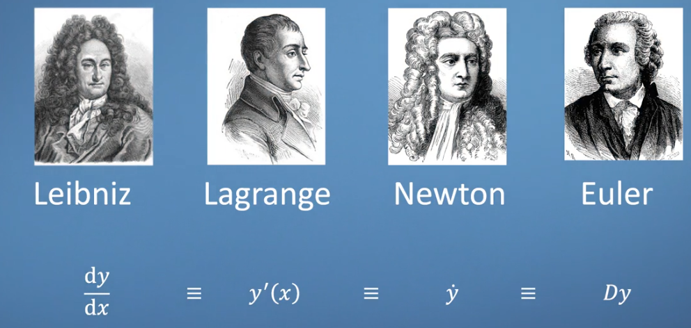


## Functions

```
INPUTS (a, b, c, ...) =>  [FUNCTION]  => OUTPUTS (p, q, r, ...)
```


$f(x) = x² + 3$

$f(x) = f(x) + g(r + a)$


**Context**

* Functions are not multiplication
* Missing variables can be constants


**Modeling the world**

* To choose a function that represent some data
* The function is a hypothesis - it describes the real world


**Calculus**

* *To investigate how functions change with respect to they input variables*
* Manipulate functions
* A set of tools


# Rise over run - speed vs time


* The speed is not constant
* It's accelerating in the beginning and stopping at the end
* ==The slope indicates how great the acceleration is==

> **Acceleration** is the local gradient of  a speed-time graph
>
> Is a function of time (in this example)


Using the tangent over a point to see the slope at that point

The slope change can then be plotted to show **acceleration x time** instead of **speed x time**


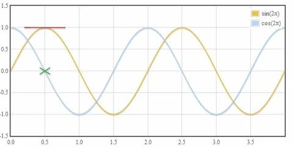


Constant speed = zero gradient = zero acceleration over time


Orange line = acceleration = `space * time ^ 2`

This is the **first derivative**


The **second derivative can be taken from plotting the slope change in the acceleration function.

It its related to the car starting and stopping


Thinking about what curve generates that derivative is called **anti-derivative**, or **integral**


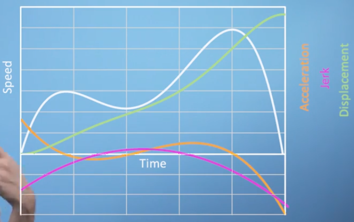


In this graph it shows the distance covered by the car - how much distance are covered per unit time - or just the speed


# Derivatives - definition

## Rise over run of a linear function

* The linear function has the same gradient everywhere


The slope of that line is represented by the amount of growth between two points (an interval) divided by the length of the considered interval - this is called *rise over run*

* **Rise** -  increase in the vertical direction
* **Run** - distance along the horizontal axis 

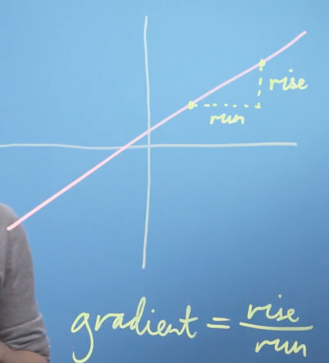


# Rise over run for more complex functions

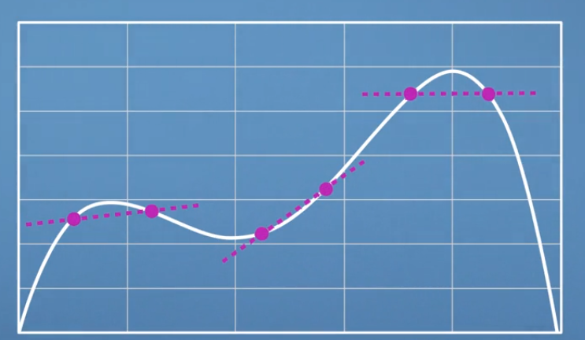


The rise over run changes depending on the chosen points


**What is the rise over run at a single point ?**


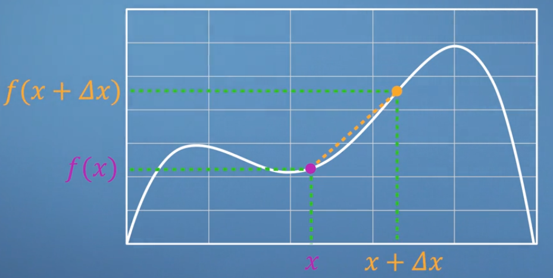


Defining the second point at a $\Delta x$ distance from the first one - we can use $f(x)$ to determinate they $y$ position


Now, writing a function for any $x$ based on the rise over run concept


With smaller values of $\Delta x$, the result becomes a better representation of the gradient


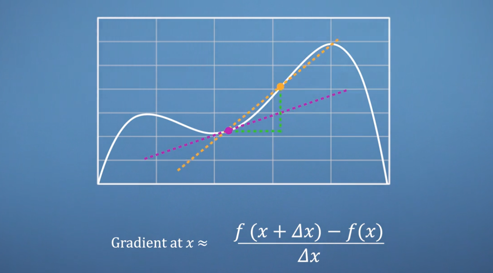


This concept can be expressed with limits - so, we want to know the gradient for an $\Delta x$ as small as possible / needed


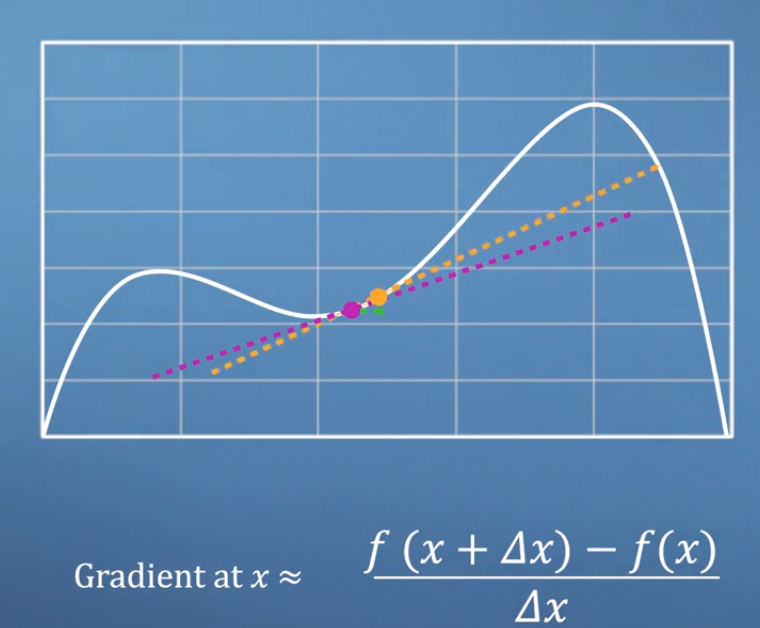


Then, we can get the slope for any single point in the function

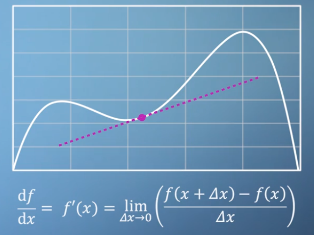


This is often represented with the notation
$$
\frac{df}{dx} = f'(x)
$$
Note that $dx$ is **not** zero

1. because we can't divide by zero - but it's a number **really** close to it

2. we could make our results better as we *"zoom in"*  at the point by making it smaller as we get closer
3. If we are far away, a value further from zero wouldn't make that of a difference


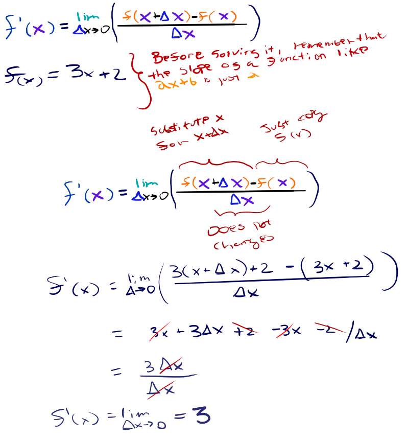

# Meanings


https://math.dartmouth.edu/opencalc2/cole/lecture8.pdf


**Critical point**: a point where the slope is $0$, often a local maximum or minimum


Imagine that a certain city got a single train railway, connecting any number of stations

## The first derivative $f'(x)$

Is the **slope** of the **tangent line** to a function at the point $x$

It tells us **whether** and **how much** a function is *increasing* or *decreasing*


* $slope > 0 \ @ \ x$: the function is *increasing* at that point - *as $x$ increases, $f(x)$ also increases*
* $slope < 0 \ @ \ x$: the function is *decreasing* at that point - *as $x$ increases, $f(x)$ decreases*
* $slope = 0 \ @ \ x$: *doesn't tell anything in particular*, the function may be increasing, decreasing at a *local maximum or minimum*


**Other properties**

* When $f'(x) = 0$ (roots of the derivative) $f(x)$ is at a local maximum or minimum - *it shows the critical points of $f(x)$*


**In summary**, the *first derivative* measures the ==rate of change== of a certain function. If we have a function $f(x)$ where the $x$ axis indicates time and the $y$ axis t


## The second derivative $f''(x)$

Note that the first derivative does tell where the critical points are, but it cannot show if they're rather local *maximums* or local *minimums* - the **second derivative can** tell this


If the **first derivative** shows that there are a critical point at $x$, i.e. $f'(x) = 0$ 

* if $f''(x) > 0$  then $f(x)$ has a local *minimum* and $f'(x)$ is *increasing* at that point, therefore, the curve around it is *concave*, pointing *down*
* if $f''(x) < 0$ then $f(x)$ has a local *maximum* and $f'(x)$ is *decreasing* at that point, therefore, the curve around it is *convex*, pointing *up*
* if $f''(x) = 0$ then we *don't learn any new information* about the point - it may be a local maximum or minimum or the function may be increasing or decreasing


# Sum rule


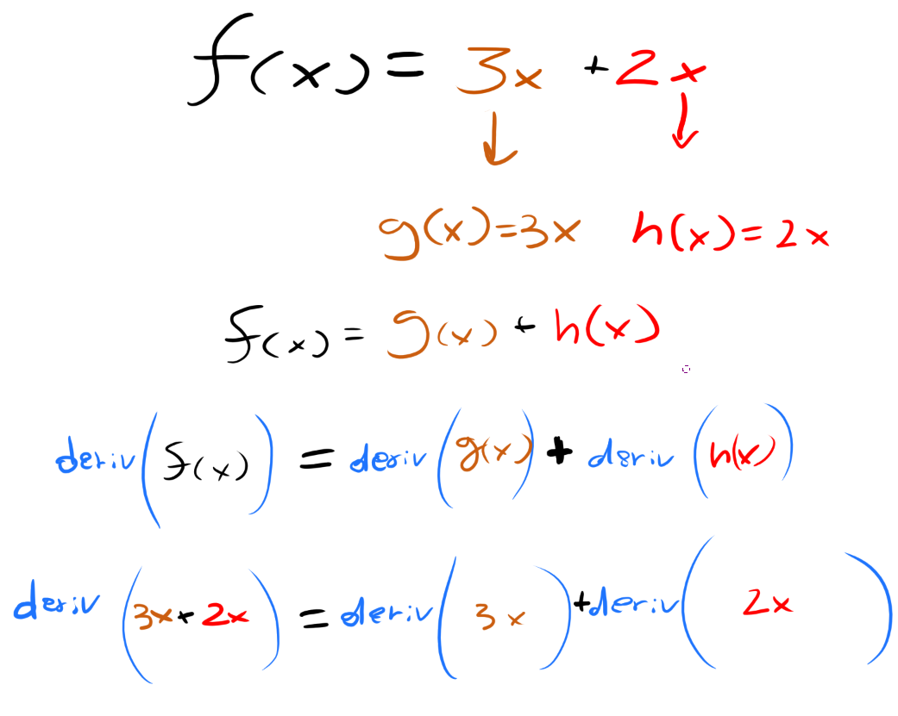


**Example**


# Power rule


# Special Cases

## $$f(x) = 1/x$$


The gradient is **negative** everywhere except at $x=0$, but at this point we can't see the gradient

The function has a **discontinuity**  because at $x=0$, $1/x = 1/0$ is not defined

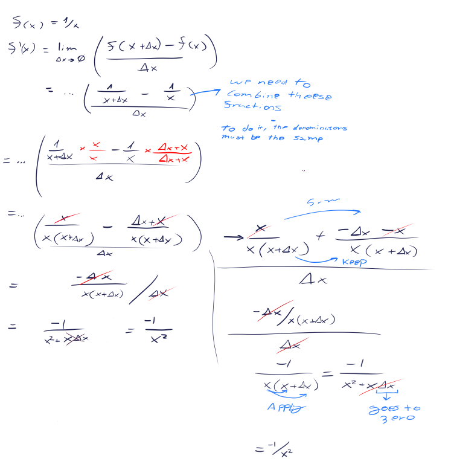


## $f(x) = f'(x)$ - the function is its own gradient

### Positive case


Besides $f(x) = 0$, only one function fit the criteria

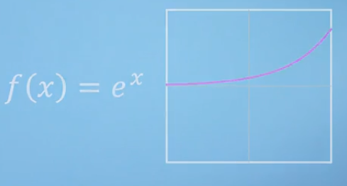


$e$ is a universal constant


$f(x) = e^x$

$f'(x) = e^x$

$f''(x) = e^x$

$f'''(x) = e^x$

$...$


## Sin and Cos

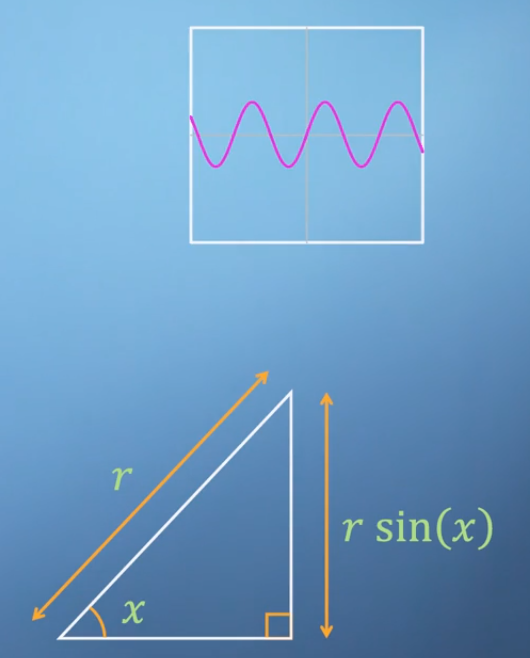


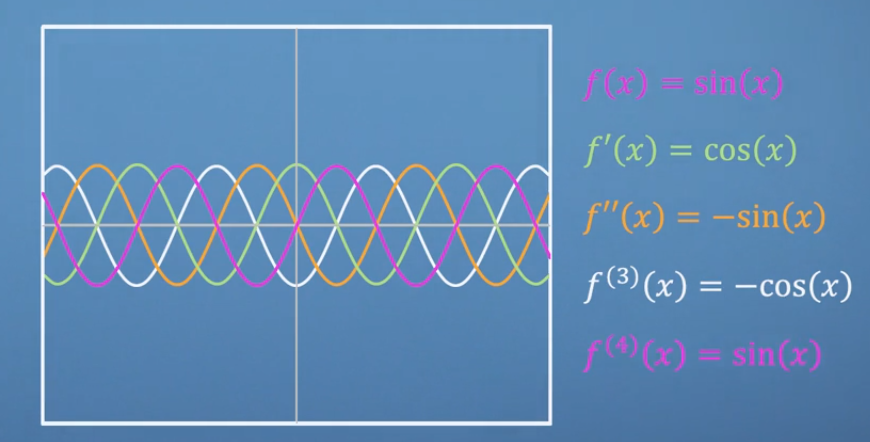


The trigonometric functions are really exponential functions

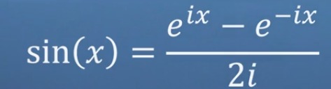


# Product rule


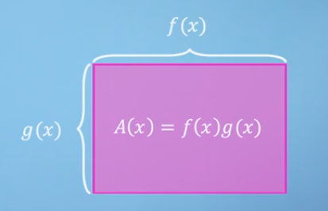

If we differentiate $f(x) * g(x)$ what we are really looking for is the change in area of the rectangle as we vary $x$


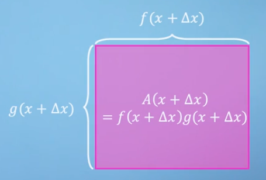


Adding $\Delta x$ to $x$ the size of the rectangle changes - in this case both sides happily increase (easier to see the concept).

We can subdivide the new rectangle in smaller rectangles, one of them has the same size of the original one.

 


Then we can calculate the width and height of the other rectangles


We can then write an expression only for the area of the new rectangles


As $\Delta x$ approaches $0$, **all** rectangles will shrink, **but**, analyzing the equations, note that the **smaller** rectangle will shrink the fastest 


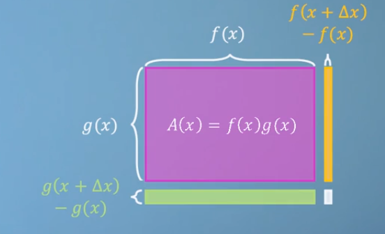

We can ultimately disconsider the area of the smaller rectangle

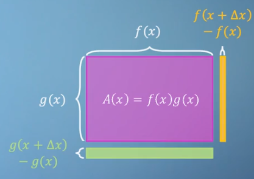

The limit will be calculated by


It's useful to rearrange it in the following way:


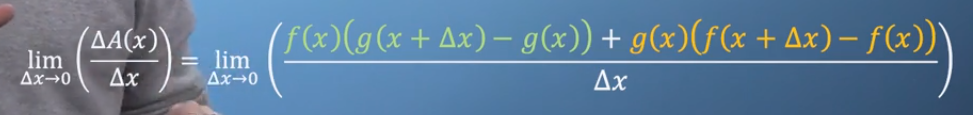

1. Split into two fractions


2. Taking $f(x)$ and $g(x)$ out of the numerators


Note that both fractions are just the derivatives for $g(x)$ and $f(x)$

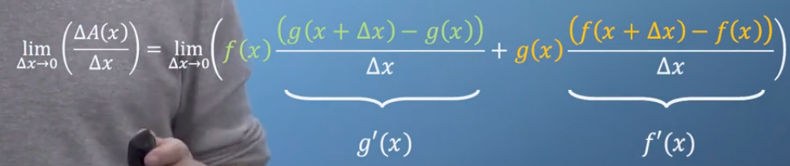


This can be rewritten as


**Contemplate** the product rule


# Chain rule


## Nested functions


1. $h( \ \ )$ - how happy i am
2. $p( \ \ )$ - how many pizzas i have eaten
3. $m$ - how much money i make


Note that we are relating the concept of *money* to *happiness*, but via the concept of *pizza*

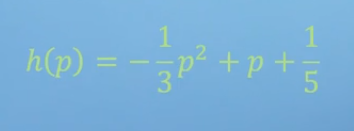

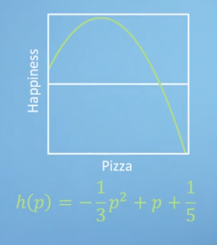


**By knowing how much money i have now, how much effort should i put into making more, if my aim is to be happy?**


So, we need to know the rate of change for happiness is with respect to money. Which is $dh/dm$

In this simple example we could just substitute one function into another and derive it


**But** the chain rule provides us with a more *elegant* solution that will work even for more complex functions, where simple plugging in into another (direct substitution) isn't an option.


In this particular notation convention, the product looks like it would give the desired function - this approach is called the chain rule.

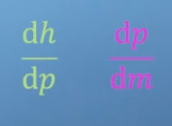


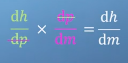


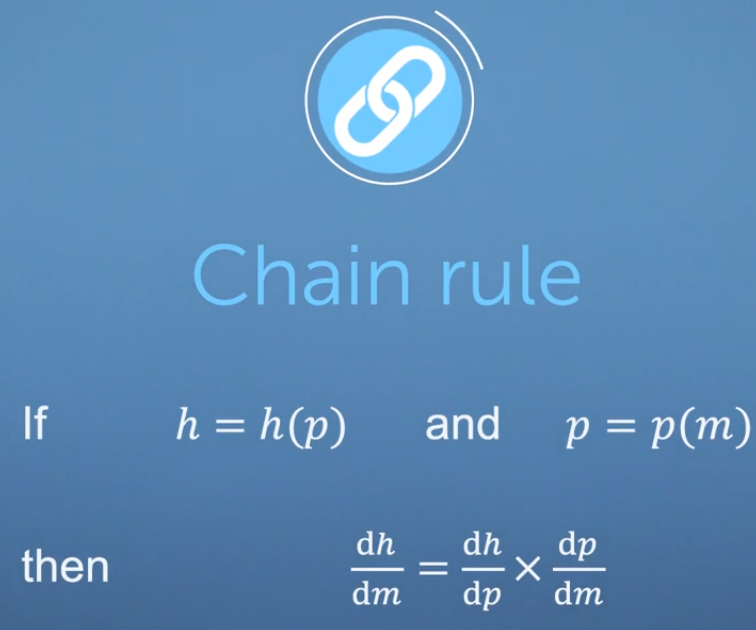


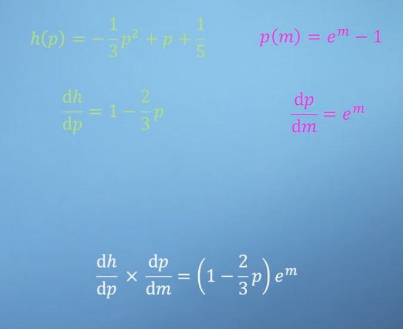

So, if we don't want $pizzas$ to appear in our final function, we just need to substitute $p$ for its function in terms of $m$


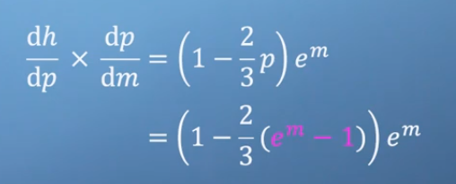

Then rearranging the terms

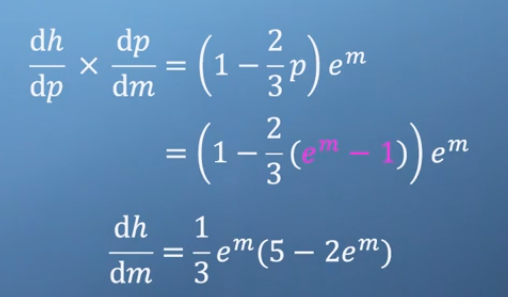

**Result**


# Taming a beast

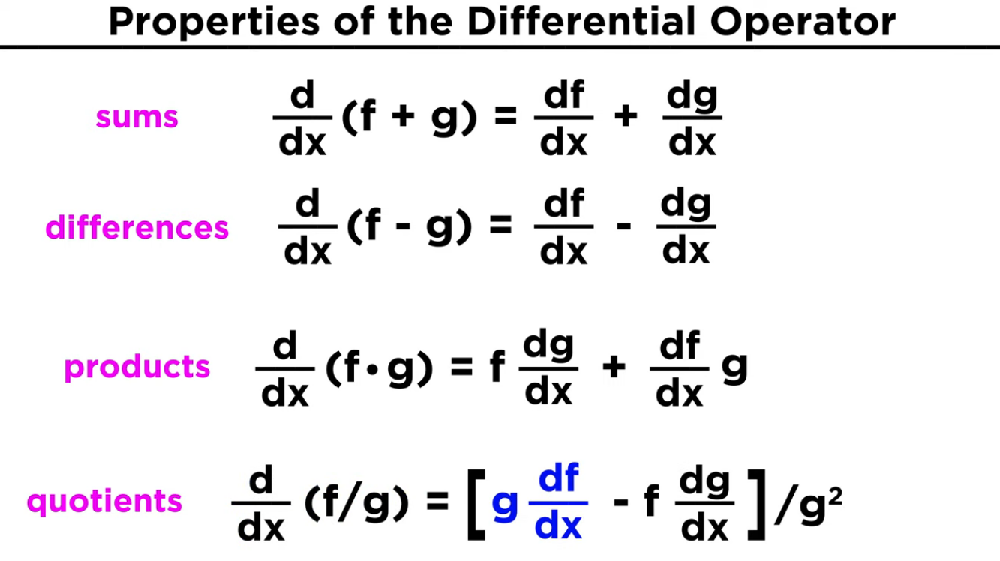

**~The beast~**


$$
f(x) = \frac{sin(2x^5 + 3x)}{e^{7x}}
$$


 


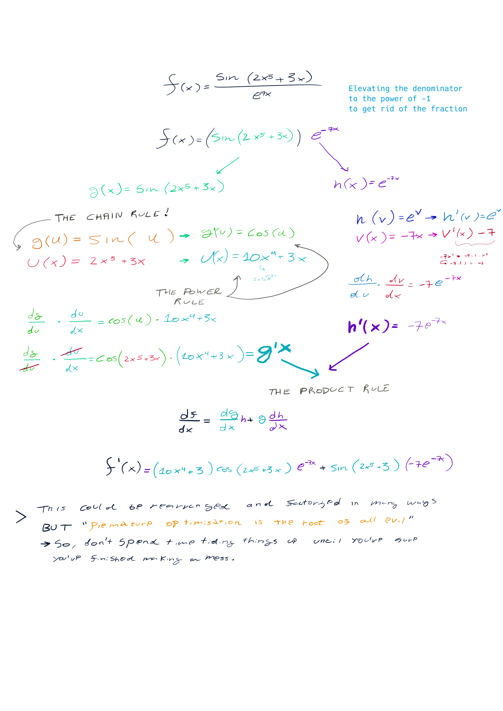


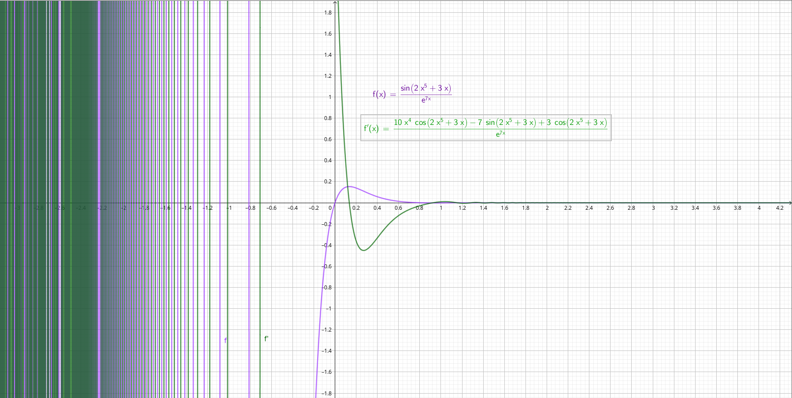


# Multivariate calculus

Multiple input or output variables

*How to apply the concepts shown before to systems with multiple variables?*


## What a variable is?

**1. One of the variables is a function of the other**

$y = f(x)$


**2. Dependent variables**

When we can say

$y = f(x)$

But not

$x = g(y)$

Because the other way around doesn't necessarily makes sense


The vehicle *speed* is a function of *time* because at each point in time, the vehicle can be at **one** and only one *speed*

However, we cannot say that *time* is a function of *speed*, because a same *speed* can happened at different points in *time*


Therefore, the *speed*  is a **dependent** variable, because it depends on *time* and the *time* is the **independent** variable in this context


> Typically, when you first learn calculus, you take functions containing *variables* and *constants* and then *differentiate* the **dependent** variables (such as speed) in respect to the **independent** variables (such as time).
>
> However, what gets labeled as a *constant* or a *variable*  can be subtler then expected - it will require you to understand the **context** of the problem being described


*The car example*

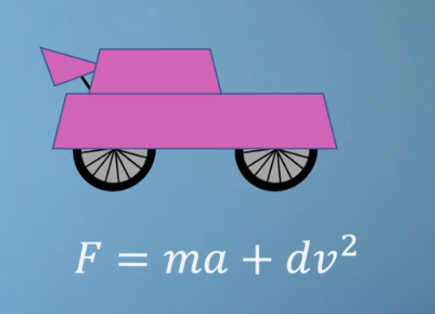


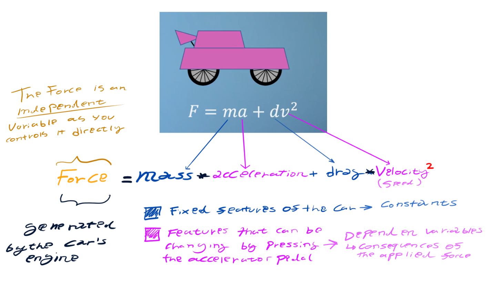


> But if you're a car designer, and have a target speed, then your speed becomes the constant and the mass and drag can be adjusted by changing the car's design
>
> 
>
> TL; DR; - you can differentiate any term with respect with another - it depends on the context 


*Another example* - designing a can

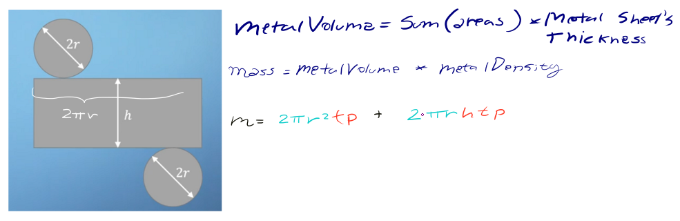


In principle we could change about everything about the can, even the metal's density (except for $\pi$ 🤷)

So, let's find the derivative of the can's mass with respect to each variable


>  **When differentiating in respect to some variable, simply consider all of the other variables to behave as constants**


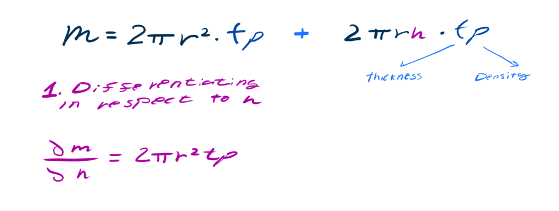

Note that the first term doesn't contains $h$, so the derivative of constants just becomes $0$, as usual.

The second term does contains $h$, and it is just multiplied by some constants - differentiating this leaves just those constants

The partial derivative in respect to $h$ doesn't even contains $h$ because the mass will vary *linearly* with the height when all else is kept constant


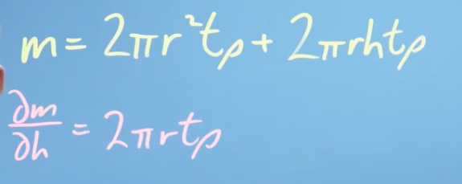


> Note that the notation also changed - instead of the $\frac{dx}{dy}$ we're using $\frac{\partial x}{\partial y}$, which indicates that we are differentiating a function of more then one variable
>
> 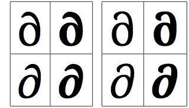


> **Partial differentiation** is in essence just taking a multidimensional problem and pretending that it's a standard 1-D problem as we consider each variable separately


# Differentiate with respect to anything

Working on the example


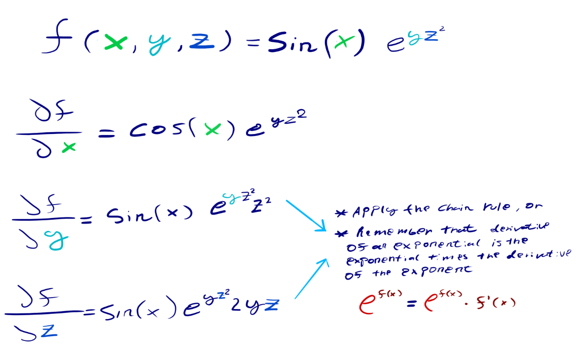


## Total Derivative


 

Imagine that the variables  and  were actually themselves a function of  a single other parameter where:


$$
x = t-1
$$

$$
y = t²
$$

$$
z = 1/t
$$


We are looking for the derivative of $x$ with respect to $t$

In this simple case $t$ can be directly substituted into the function and the derivative taken


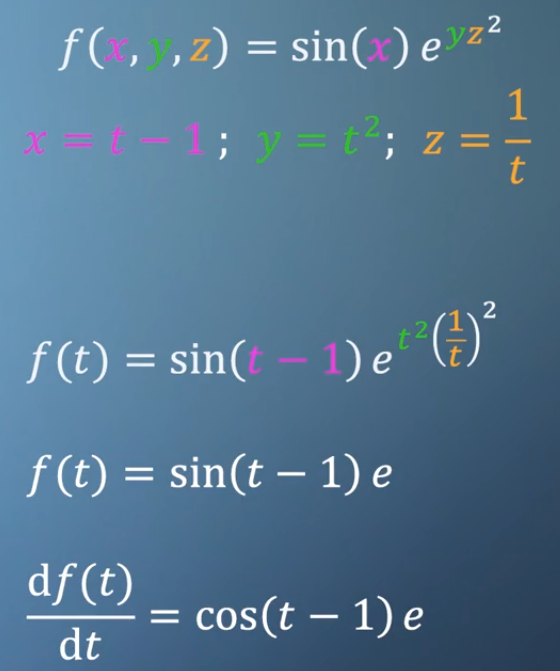


In a more more complicated scenario the **chain** rule comes in handy

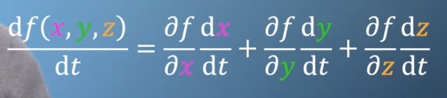

The derivative with respect to the variable $t$ will be the sum of the chains of the three variables

So we need to know the derivatives with respect to $t$

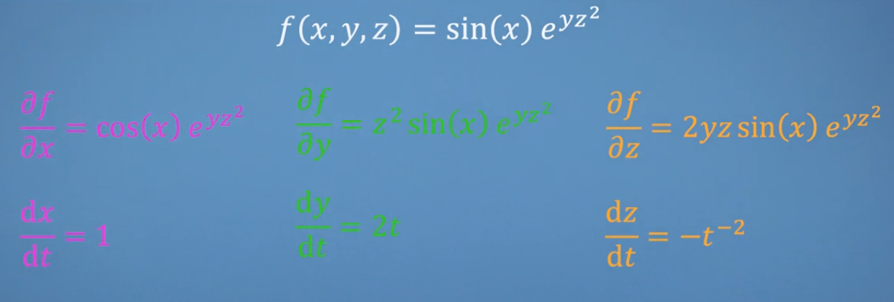


<iframe width="100%" height="600" src="https://www.youtube.com/embed/NO3AqAaAE6o" frameborder="0" allow="accelerometer; autoplay; encrypted-media; gyroscope; picture-in-picture" allowfullscreen></iframe>
Analogy


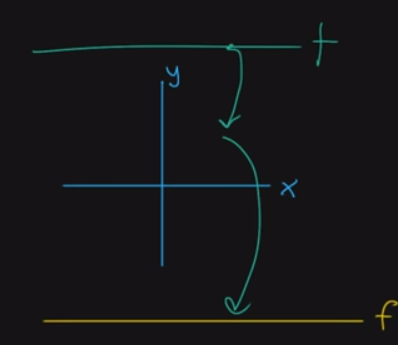


# Jacobian

* Brings in some of the ideas from linear algebra to build partial derivatives into something particularly useful
* The concept can be applied to a variety of different problems


## Jacobian of a single function of many variables

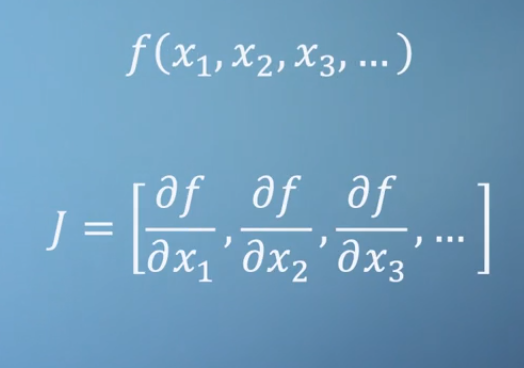

* The Jacobian is a **vector** where each entry is the **partial derivative** of $f$ in respect to each one of those values in turn
* By convention is written as a **row vector** instead of a column vector

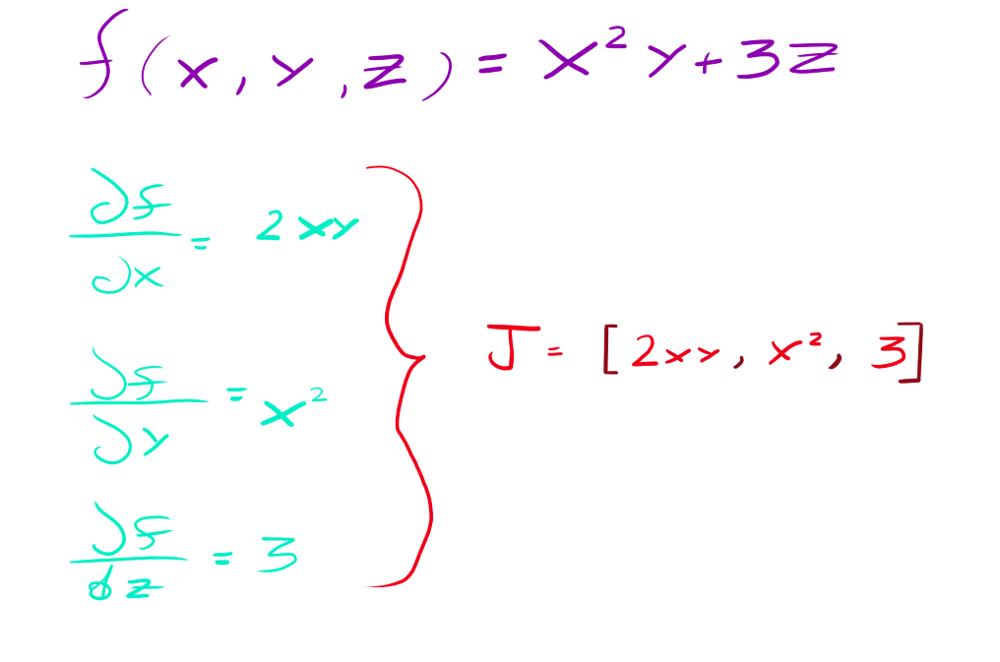


$J$ is a vector in which when we give it a specific $x, y, z$ coordinate will return a **vector** pointing in the direction of **steepest uphill slope** of this function


In this specific example, $z$ is a **constant** which does not depend on the location selected


Another example


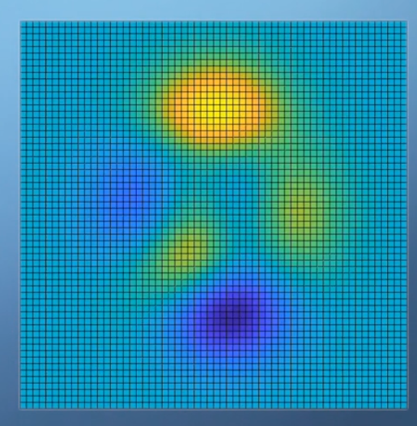

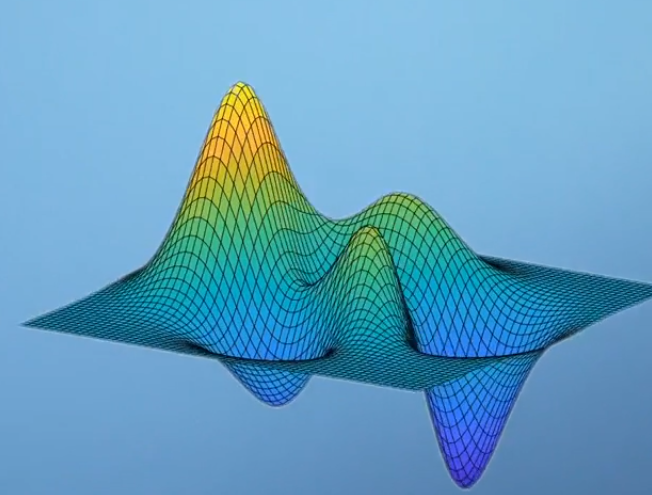

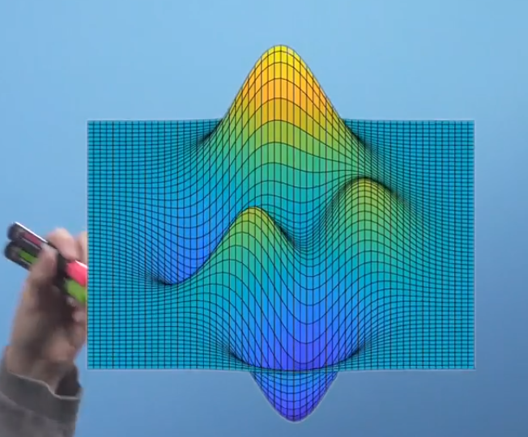

The **steeper** the slope grater the Jacobian becomes at that point


*Converting into a contour plot*

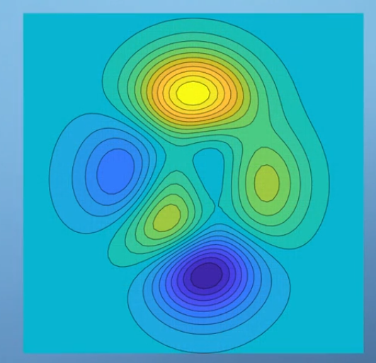

*Plotting Jacobian vectors*


# Jacobian Applied

## Example I

$$
f(x, y) = e^{-(x² + y²)}
$$


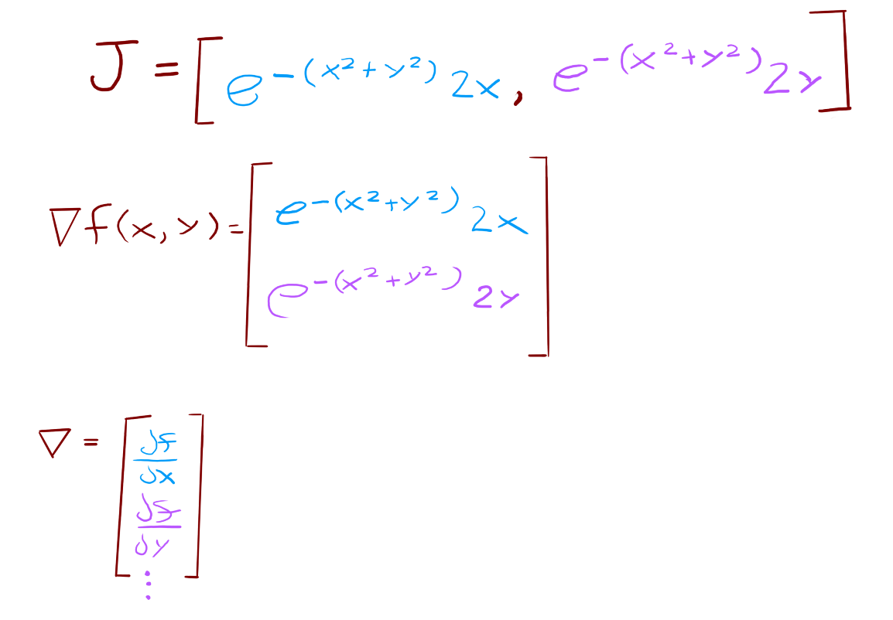

> Remember kids
>
> If
> $$
> f(x) = e^{g(x)}
> $$
> Then
> $$
> f'(x) = e^{g(x)} * g'(x)
> $$
> If we are dealing with multivariate calculus we will differentiate $g$ with respect to some variable like $x$ or $y$
>
> 


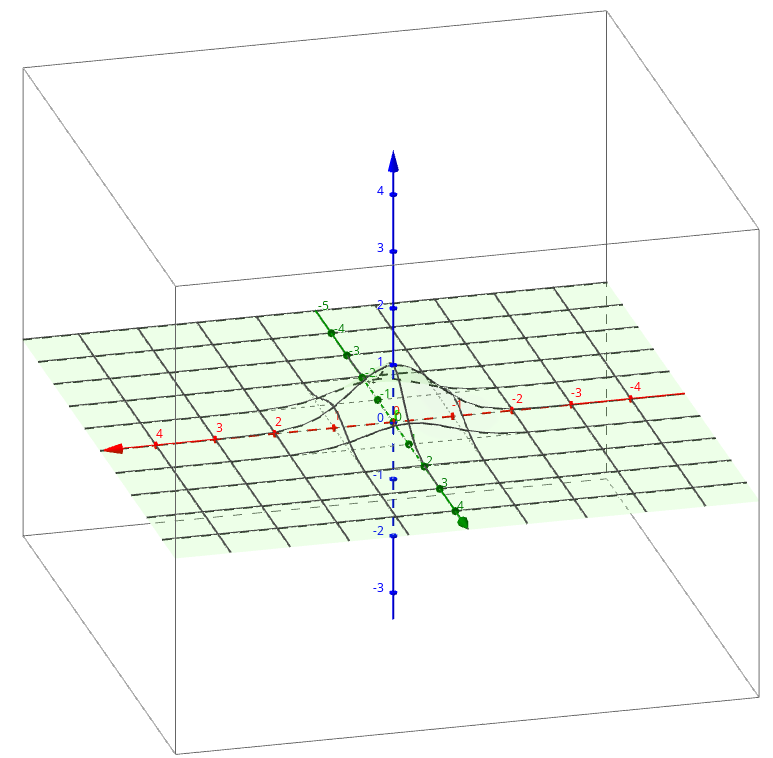

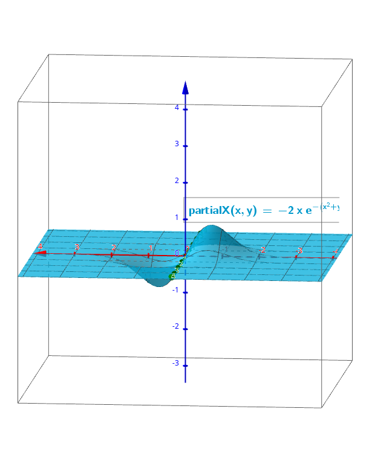


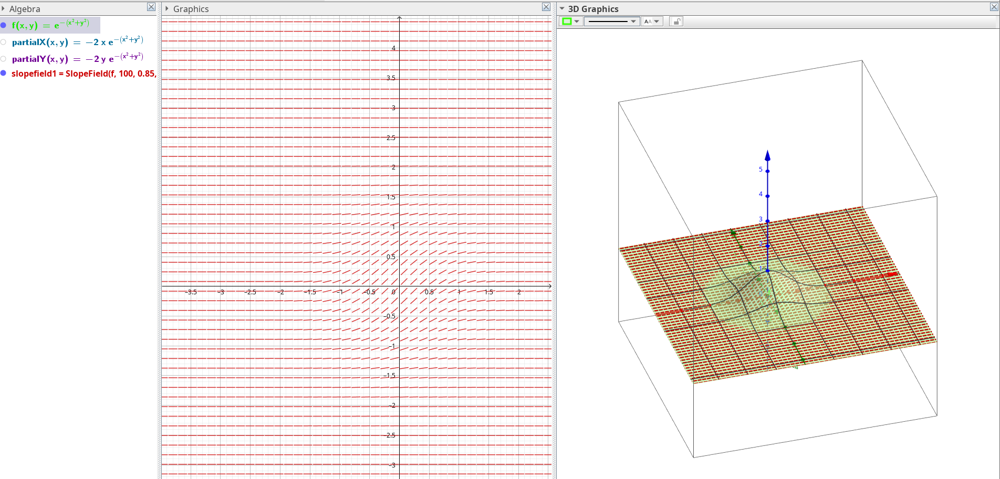


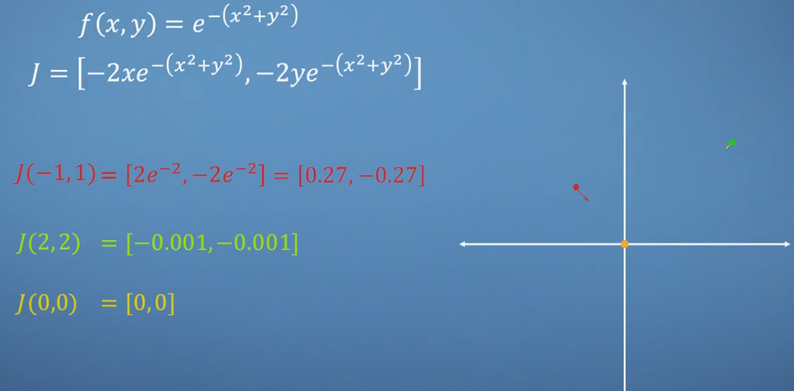


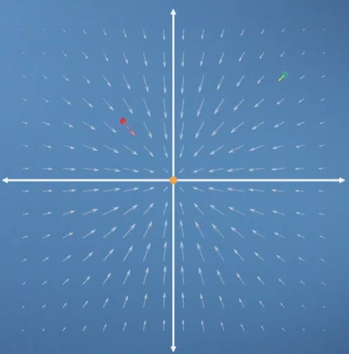


## Example II


This function receives a vector as the input but **gives also a vector as the output**

We can think about this problem as being contained by two vector spaces, one for $u, v$ and another to $x, y$

Each point in $x, y$ has a corresponding point in $u, v$

As we move in $x, y$, we also move in $u, v$, but making a different path


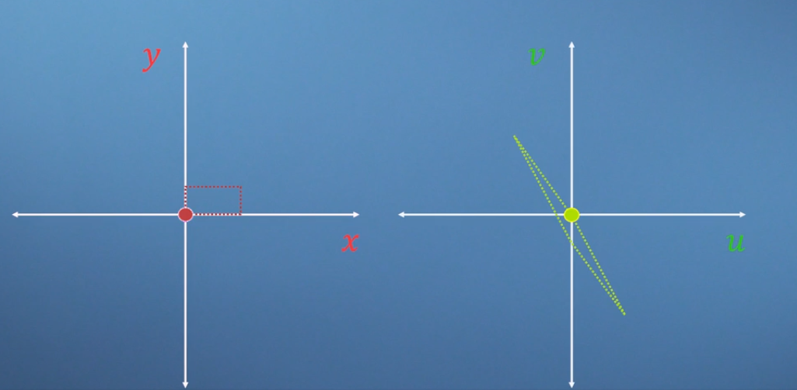


The *Jacobian* can them be represented as a matrix by stacking the rows


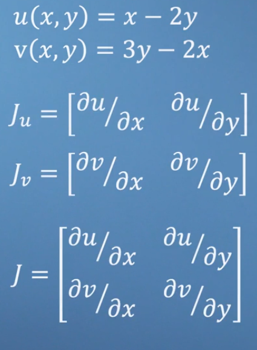

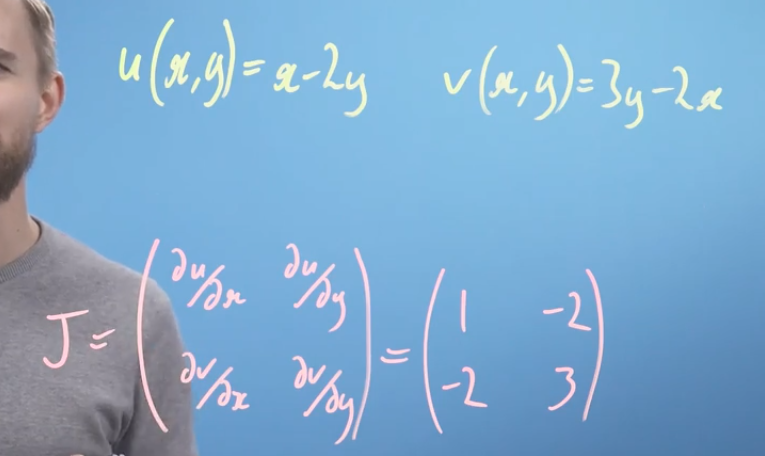


This matrix is just a transformation from $x, y$ space to $u, v$ space

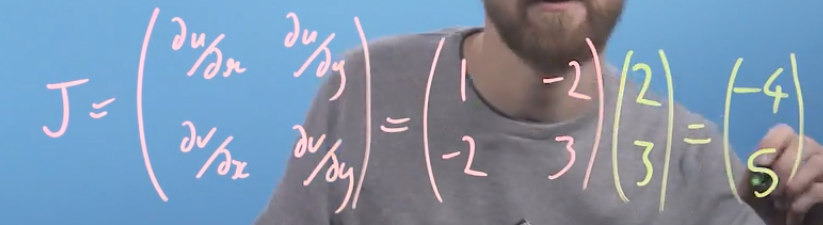


## Example III

Many of the functions aren't so nice

 They can be highly non-linear and much more complicated

**But** often they may still be smooth - by approximating enough we can say that a region is approximately linear

**Therefore** adding all the contributions from the *Jacobian* *determinants* at each point in space, we can still calculate the change in the size of a region after a transformation


**TRANSFORMING BETWEEN CARTESIAN AND POLAR COORDINATE SYSTEMS**


Polar coordinates uses an radius $r$ and an angle  $\theta$, we want the coordinates as $x, y$ values


Making the Jacobian and taking the determinant


> As we move along $r$, away from the origin, small regions of space will scale as a function of $r$


# Sandpit


**Optimization**: greatly related to find inputs that gives us the maximum or the minimum of a function 

Making $f(x) = 0$ becomes much more complicated, but also  ineffective as we can have functions with more then one point with the gradient equals to zero


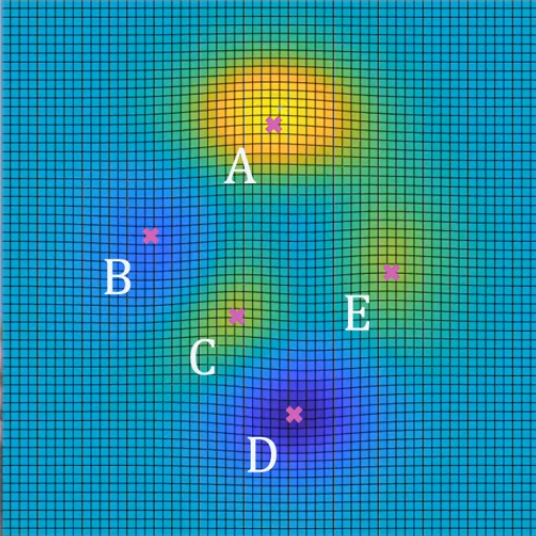


* All the peaks are maximums

* $A$ is the tallest peak, the global maximum

* All trough are minimums

* $D$ is the deepest trough, the global minimum


Going to the highest peak can be like walking at night: maybe we don't have a nice analytical expression and each point in the plot are the result of a week of processing in a supercomputer or the result of a practical experiment

**The problem**: the Jacobian points uphill, nut not to the tallest one, if you follow the arrows you will arrive at some hill with all arrows pointing towards you

**In maths** we don't need to follow the arrows, we can just teleport to any region of space - so we are not really walking


A better analogy is the sandpit:


You're using a sick to poke the sand measure how deep the soil beneath is, you can poke any point in space and you can't see the hills because they're blocked by the sand


# The Hessian

* Extension of the Jacobian vector


**Takes the second order derivatives into a matrix**

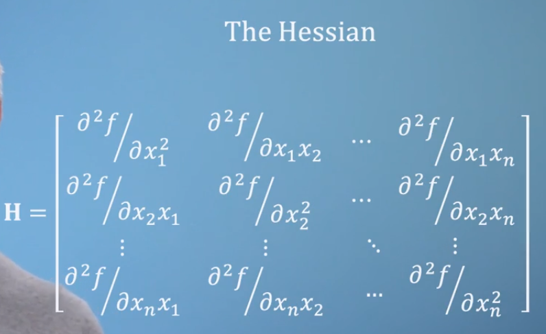

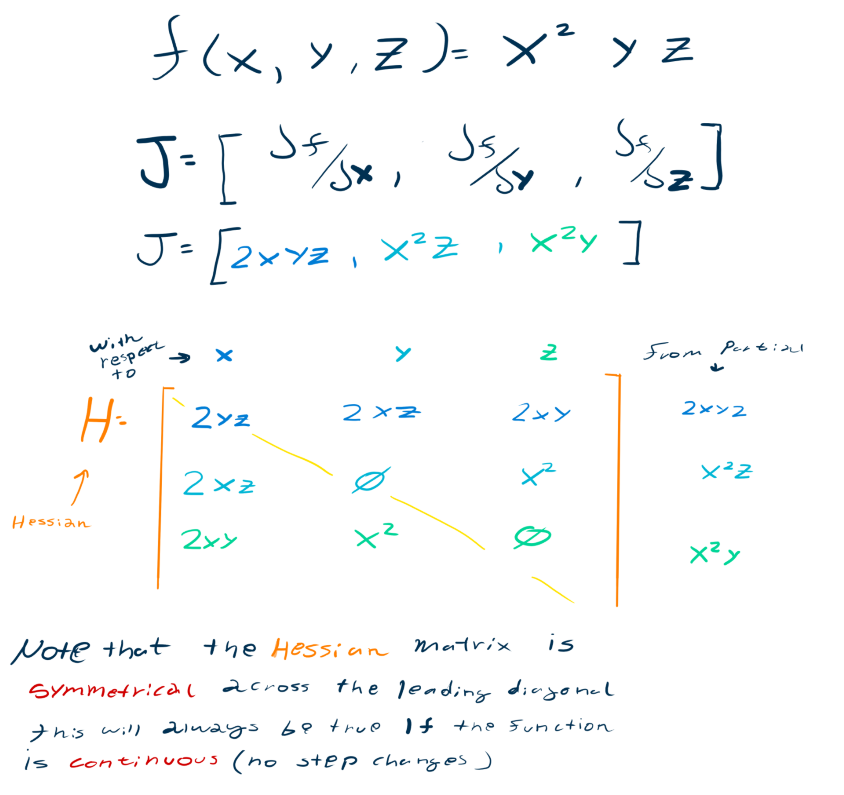


We can pass an $x, y, z$ coordinate to the *Hessian* and it will return matrix that tells us something about that point in space


## 2-D example


$$
f(x, y) = x² + y²
$$


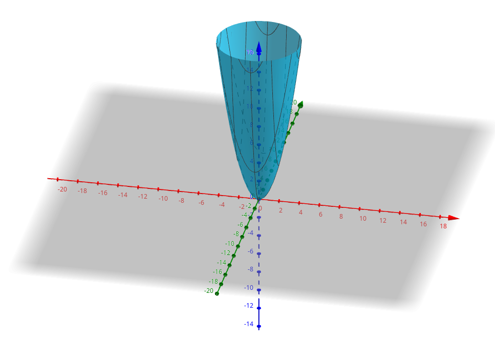


$$
f(x, y) = x² - y²
$$
At the origin we have a **saddle point**

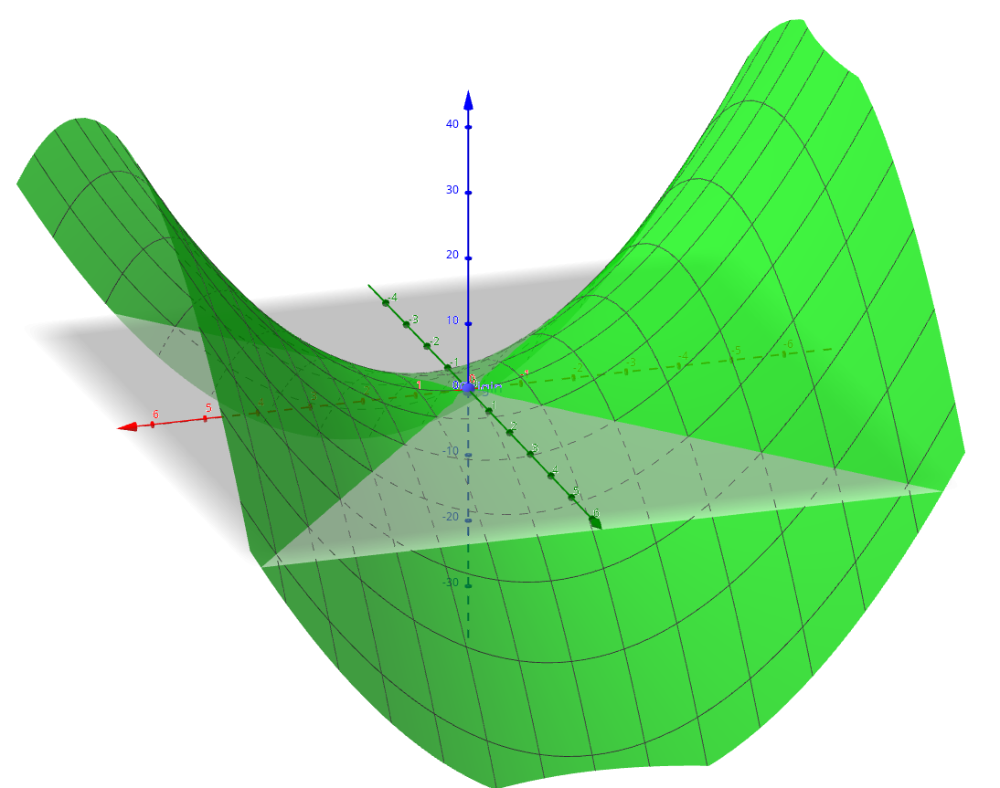


The Hessian is negative, so, it is not a maximum or a minimum


But the gradient is flat

The slope is coming down in one direction and upwards in another direction

That feature is called a **saddle point** 

They can cause a lot of confusion when searching for a peak


# Reality is hard


1.  In reality we deal with **hundreds** or **thousands** of dimensions - we can't simply plot them as a nice landscape but rather use our intuition from 2-D to guide us and enable us to trust the math, because the math works in any case.

2. You could not have a nice analytical formula that describes your problem - even if this formula is in 2-D space, calculating each point can be very expensive, depending on a supercomputer's processing power or laboratory staff

3. Not all functions are nice and smooth - what if your function contains a sharp feature like discontinuity 

4. For any number of reasons the function can contain noise, making the Jacobian useless unless we were careful

**The question**: how to calculate the Jacobian for problems that we don't even have the function that we're trying to optimize? 

**The answer**: numerical methods

* Some problems do not have a nice formula
* Some problems do have a formula, but solving it wit take until the end of time

There are a range of techniques that allows us to find approximate answers to that questions


**The derivative** measures the slope of two points as their distance tends to zero - if we can't calculate every point for a formula, let's use only what we got to build the derivatives - **approximation**


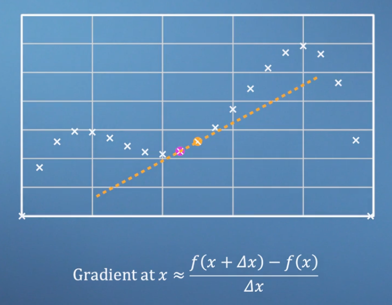

But that's not practical for higher dimension scenarios


If we start from a initial location and we would like to approximate the Jacobian we could approximate each partial derivative intern:

* Taking a small step on $x$ allows us to calculate a proximate partial derivative with respect to $x$
* Taking a small step on $y$ allows us to calculate a proximate partial derivative with respect to $y$


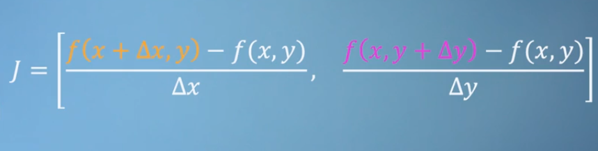

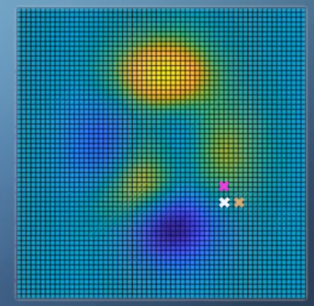


1. *How big should the little step be?*

**Too big**: bad approximation

**Too small**: numerical issues - if the points are too close, the computer may not register any movement at all (floating point range stuff)


2. *What if the data is a bit noisy?*

**Simplest approach**: to calculate the gradient using a few different step sizes and taking some kind of average


#  Multivariate Chain Rule

## Simplifying the  notation


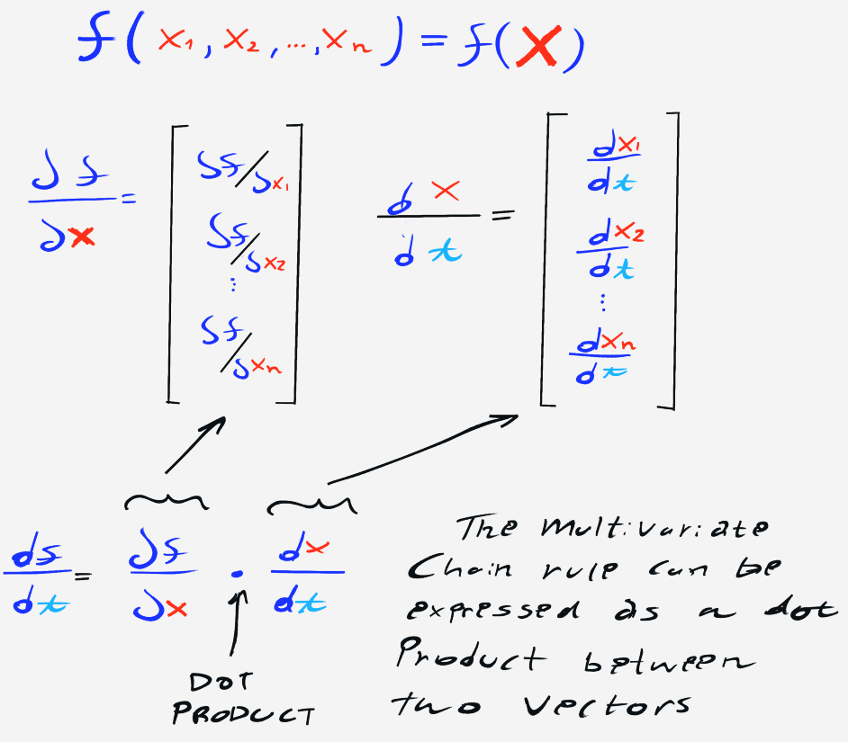


## Univariate example

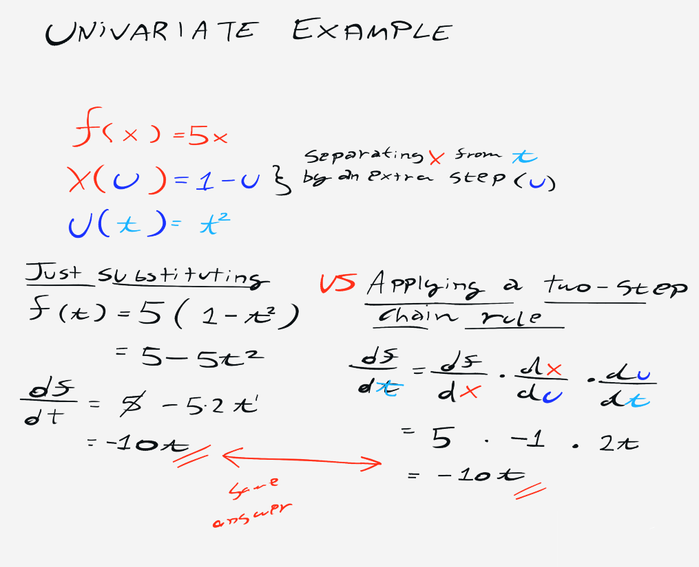

## Multivariate example


Differentiating the scaled valued function $f$ with respect to the *input vector* $\bold{x}$ gives us the **Jacobian row vector**

Differentiating a vector valued function $\bold{u}$ with respect to the *scalable variable* $t$ gives us a **column vector of derivatives**


**But, and the middle term?**


For the function $\bold{x}$ wee need to find the derivative of each of the *two output variables* with respect to each of the *two input variables* - we end up with **four terms** in total

This can be arranged as a **matrix** - this object is referred as a **Jacobian**


> The derivative of $f$ with respect to $t$ is the product of *the Jacobian of $f$* with the *Jacobian of $\bold{x}$* and the *derivative vector $\bold{u}$* 


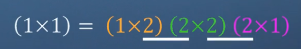


# Simple Neural Networks


Normally they are drawn as something like:


But **fundamentally**, they're just a **mathematical function**

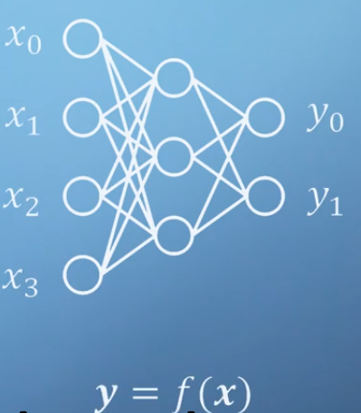

It takes variables in and spits variables out - where both of these variables could be vectors


## Simplest possible case

 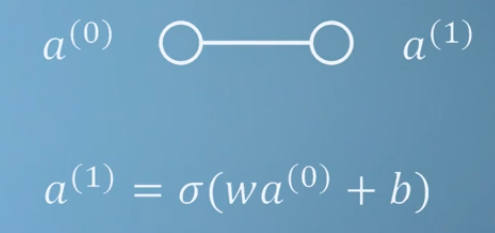

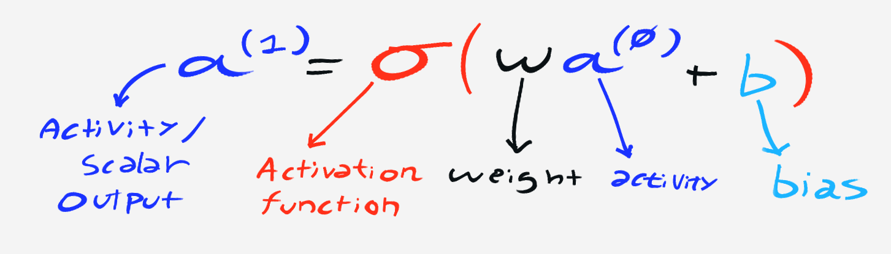


The relation between neural networks and the brain comes from $\sigma$, the activation function


Neurons in the brain receive information from their neighbors through chemical and electrical stimuli

When the sum of all these stimulations goes beyond a certain threshold - the neuron activates and starts to stimulating its neighbors

This behavior can be mathematically expressed by some functions e.g. the hyperbolic tangent function

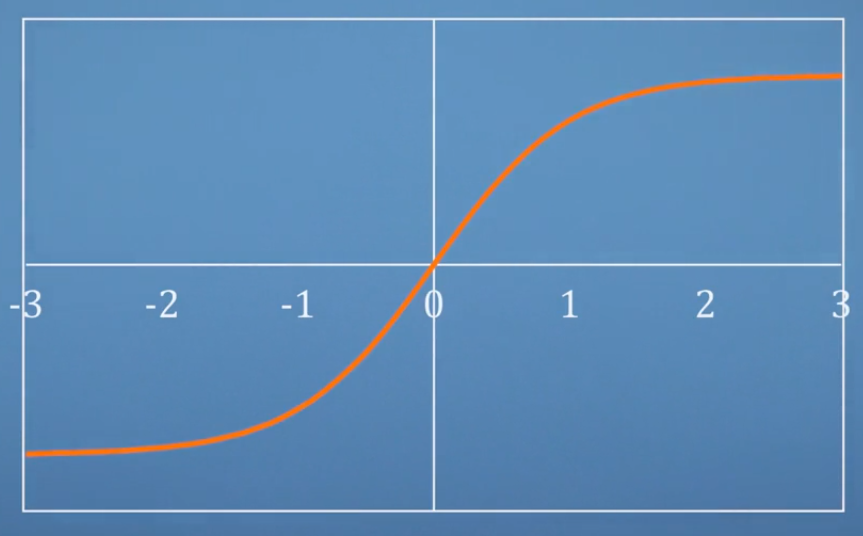


$tanh$ belongs to a family of similar functions all with an "s" shape - they're called *sigmoids* - hence, the name/symbol **sigma** 


## Adding more neurons


For any number of neurons


Using the algebraic notation

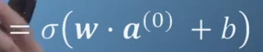

## Adding more outputs

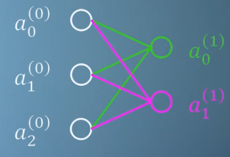


Combining in vector form

 


## Beginning to generalize

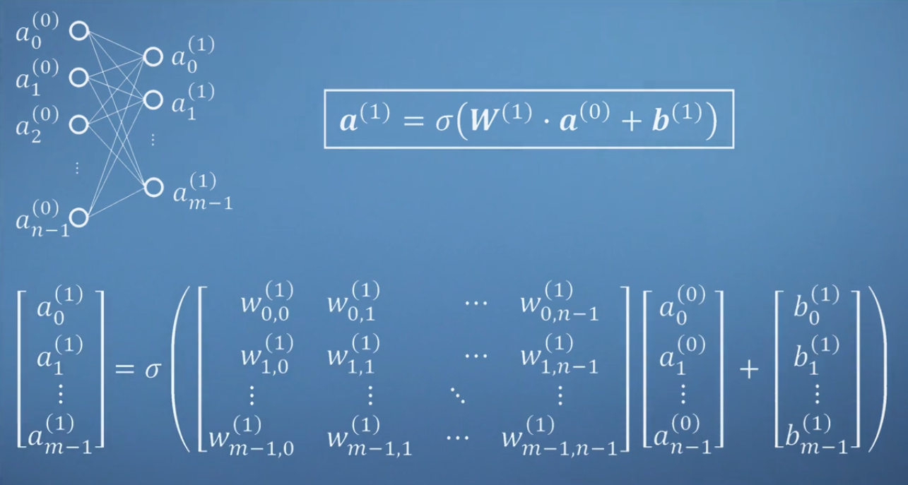


### Hidden Layers

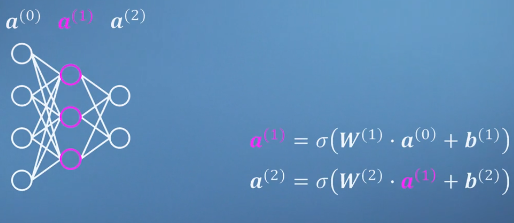


## In summary

This is the linear algebra needed to describe the output a simple *feed-forward* neural network


# Training

* Change the weights and biases to do something useful
* Generally, we're speaking of **labeled data**


## Back-propagation

Looks at the output neurons and works back trough the network

**Objective:** to find the weights and biases that best match the input with the labeled data

Initially we  initialize them as random numbers, then calculate a *cost function*

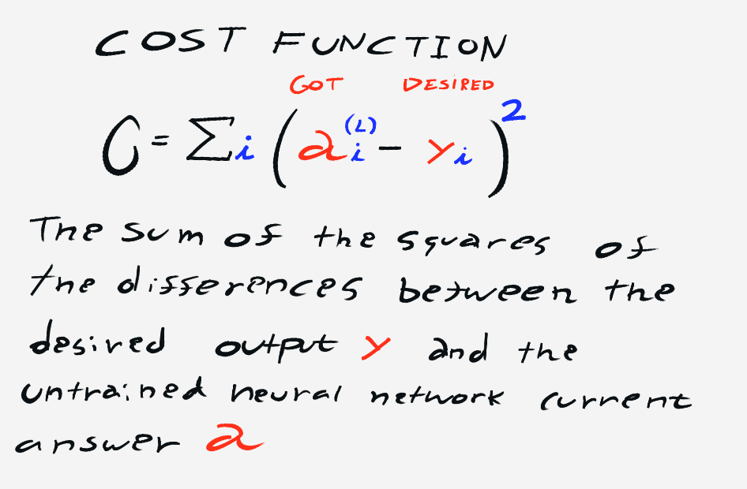


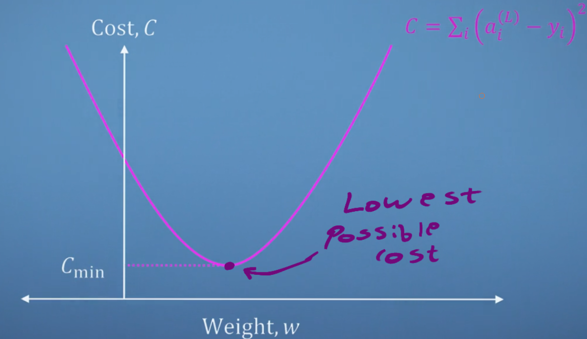

At some initial point $w_0$ - if we could work out the **gradient of  $C$ with respect to the variable $w$**

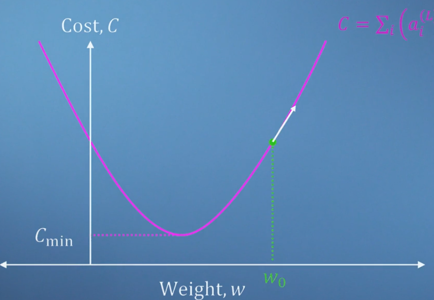

Then we could just **head in the opposite direction**


More realistic scenario - there are lots of local minimums

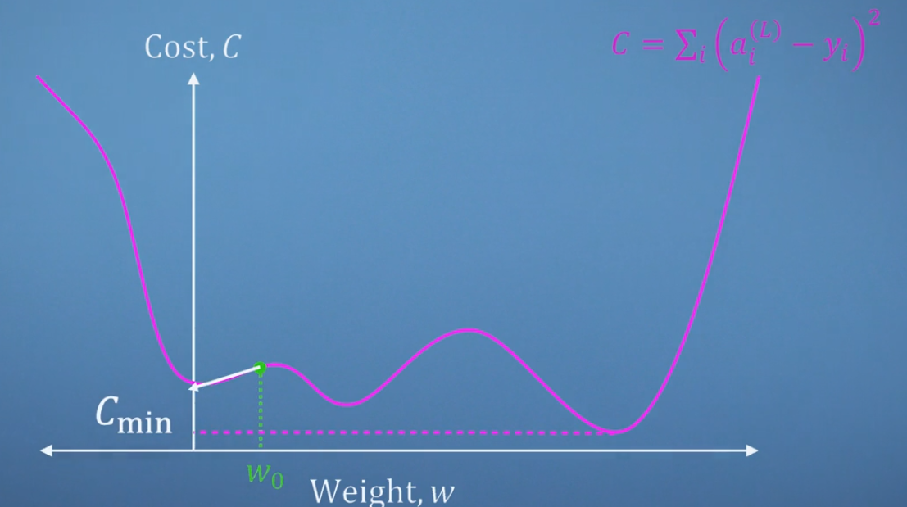

And we need to solve this cost function to all of the weights - so we are actually looking for the minimum in the hyper-surface that they form

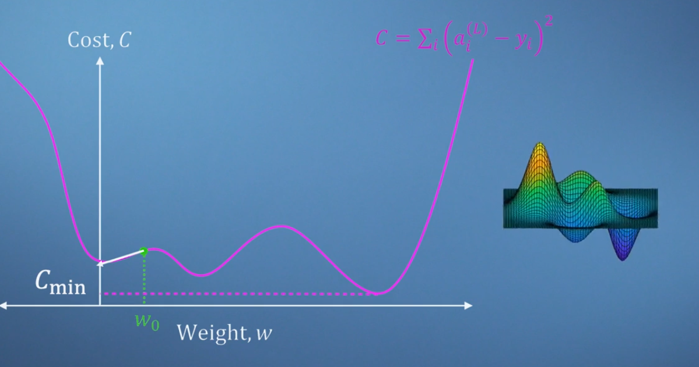


> If we want to head downhill / to $C_{min}$ we need to build the *Jacobian* by putting together the **partial derivatives of the cost function $C$** with respect to **all of the relevant variables**


Knowing what we have to do, let's write a *chain rule expression* for the partial derivatives for the **cost** with respect to either the **weight** or the **bias**

The $a^{(1)}$ term links those derivatives


It's often convenient to throw the weight plus bias terms to a separate function i.e. to use a new term

This will allow us to think about differentiating the particular $\sigma$ function that we had chosen separately

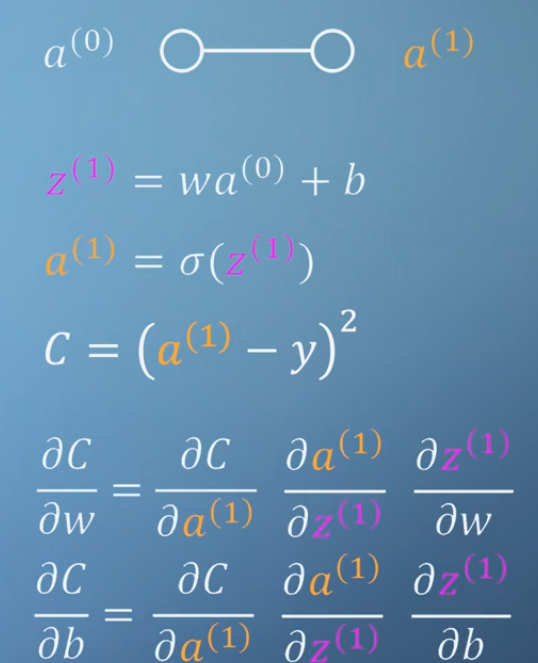

Now we can navigate trough the $w, b$ space in order to minimize the cost of the network for a set of training examples


# Building approximate functions


To derive a function that is a good representation of another function at least inside some boundaries - we can do this with **Taylor Series**

$t^*$ is a good representation of $t$ **around** the $m=1.5$ - but it becomes a poor representation further away from it


# Power Series


**Taylor Series** are composed by coefficients in front of increasing powers of $x$, a power series

Example

$g(x) = a + bx + cx² + dx³ + \cdots$

Potentially going to infinite


In **Taylor Series** the approximation becomes better and better as we increase the number of terms - a pattern may emerge


| Order of approximation     | General Formula                               |
| -------------------------- | --------------------------------------------- |
| Zeroth order approximation | $g_0(x) = a$                                  |
| First order approximation  | $g_1(x) = a + bx$                             |
| Second order approximation | $g_2(x) = a + bx + cx²$                       |
| Third order approximation  | $g_3(x) = a + bx + cx² + dx³$                 |
| Nth order approximation    | $g_n(x) = a + bx + cx² + dx³ + \cdots + kx^n$ |


These short sections of the series are called **Truncated series**

The approximations will visually look like:

**Zeroth**: just a straight line, without any angle the best we can do is make it pass trough the point horizontally


**First**: we can do a line with an angle, the best approximation would be a line with the same slope as our original function at that point


**Second**: now we got a quadratic function, this allows us to make a single curved shape - for the points immediately around our point it's a nice approximation

  

**Third**: we can approximate it even more, now with draw up to two curves


**Fourth**

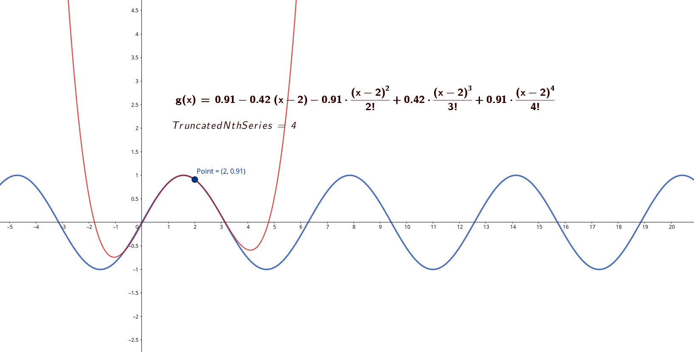

**Fifth**


**Animation**


<video src="multivariate_calculus.assets/taylorseries.mp4"></video>
# Power Series derivation

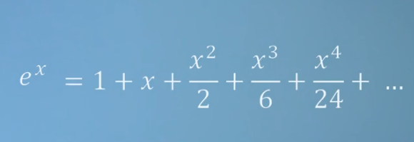

> If we know everything about a function at the point $x=0$:
>
> * Value
> * First derivative
> * Second derivative
> * Nth derivative
>
> then we can use that information function to reconstruct that function everywhere else
>
> *If i know everything about one place, I also know everything about it everywhere*
>
> However, this is only true for a certain type of functions that we call **well behaved**
>
> * Continuous
> * That you can differentiate as many times as you want


## Example


### Zeroth order approximation

Using only the $f(x)$ - the value at that point, the best we can do is a line

The result isn't even a function of $x$


### First order approximation

We will use the **value** of the function at $x=0$ and also the **gradient** at $x=0$, which we will call **f dash** ($f'$) at $0$


### Second order approximation

We will use:

* the value at 0 ( $f(x)$ )
* the gradient at 0  ( $f'(x)$ )
* the second derivative at 0 ( $f''(x)$ )


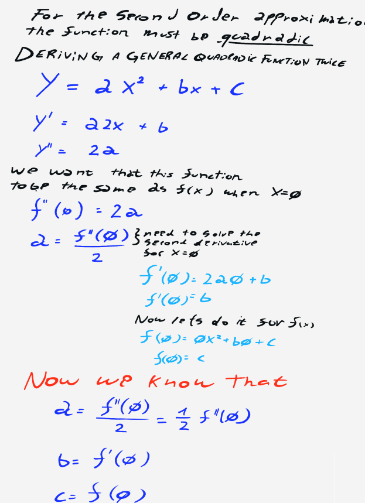


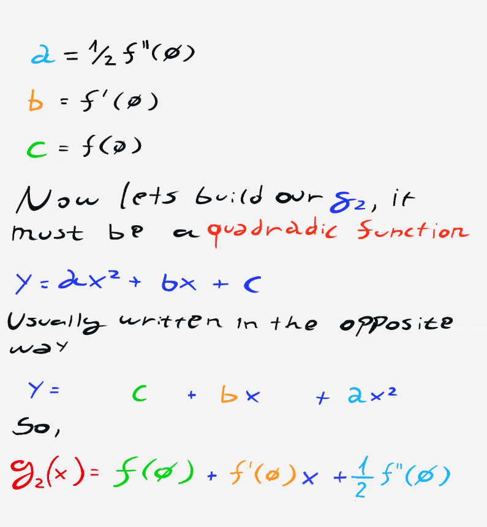


### Third order approximation


Note that we could add higher order terms piecewise, and the lower order terms will remain the same


### Fourth order approximation

Let's try to generalize 

Note that the '$1/6$' in the cubic term was a result of having to differentiate a **cubic term twice**

And we know that for the fourth order approximation we will need to calculate the fourth derivative for a function like $f(x) = ax^4 + bx³ + cx² + dx + e$ , so we will differentiate x to the fourth power three times 

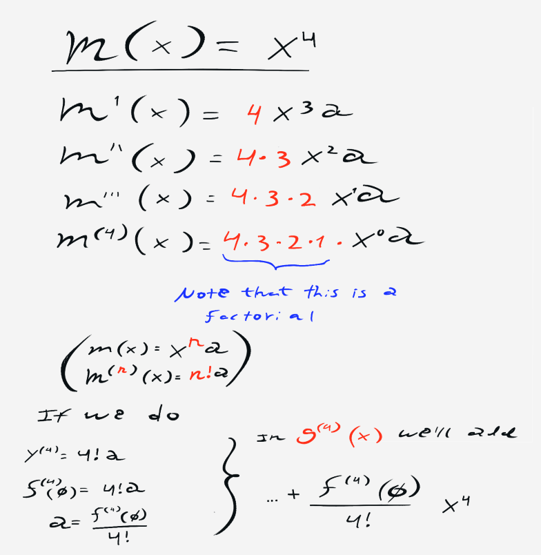

The same kind of notation can be used for the lower order terms


Remember that

$0! = 1$


So, the **nth** term of the chain will be


Therefore, the complete power series can be written as


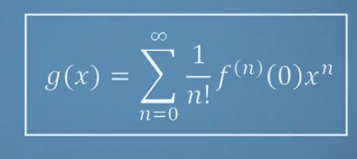

This is certainly a **Taylor Series**, but as we're looking at the point $x=0$, this is often called a ***Maclaurin Series***


# Taylor Series

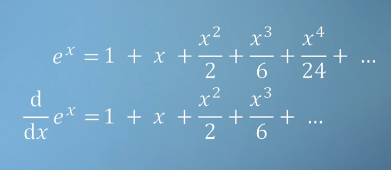

*Maclaurin* said that if you have all information about a function at $x=0$, you can reconstruct it everywhere. The *Taylor Series* simply acknowledges that there isn't nothing special about $x=0$ - it says that if you know everything about a function at **any point** you could reconstruct it everywhere anywhere. 


The number that we substitute in $\infty$ will correspond to the **accuracy** of our series    


Now, let's solve it for an arbitrary point $P$


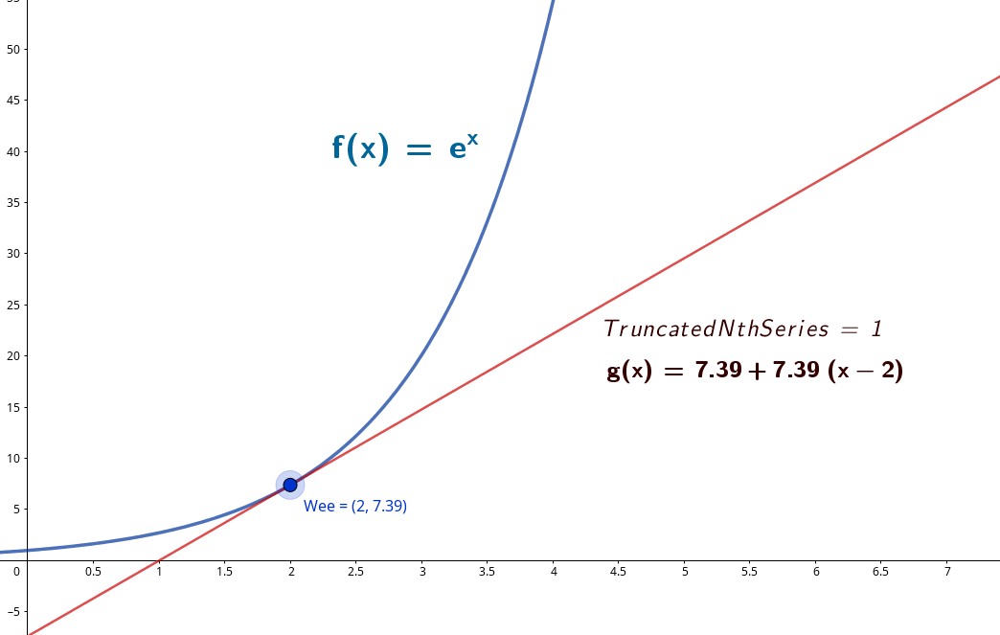


By building the approximation around the point $P$, when using the gradient temp ($f'(p)$), rather then applying it directly to $x$ we instead apply to $x-p$ or *How far are you from $P$?*

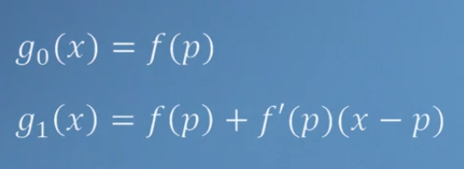


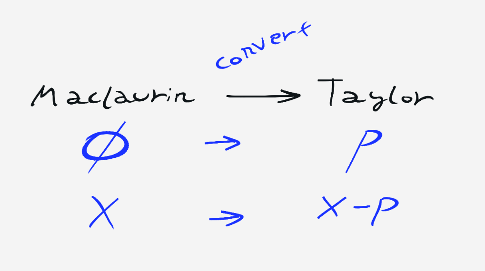


## Examples

### 1. Cosine function

* Well behaved
  * Continuous everywhere
* Infinitely differentiable


**Maclaurin Series** - to know everything about $x=0$


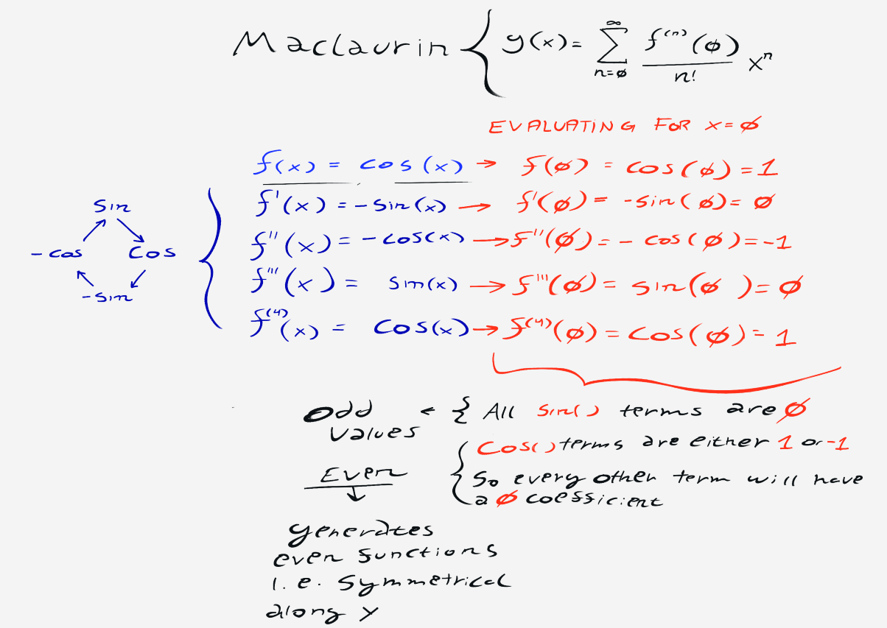

In this case, the differentiation cycle of trigonometric functions makes that every other term ($sin$ and $-sin$) of the series receives zero coefficient - these values are in the odd positions of the series, so the elements of the series in odd positions are $0$ 

$cos$ and $-cos$, at the even positions results in a coefficient of $1$ or $-1$ 

This configuration indicates that $cos(x)$ is a *even function*, (only has $x$ to the power of even numbers) being symmetrical along the vertical axis


The resultant expression doesn't even contains references the cosine function

<video src="multivariate_calculus.assets/cosine-maclaurin.mp4"></video>
### $f(x) = 1/x$ - not well behaved

* Discontinuity


<iframe width="560" height="315" src="https://www.youtube.com/embed/ag7Gt5Jorjw" frameborder="0" allow="accelerometer; autoplay; encrypted-media; gyroscope; picture-in-picture" allowfullscreen></iframe>
We can't use $x=0$, we need to use another point, so solving it by a *Taylor Series*

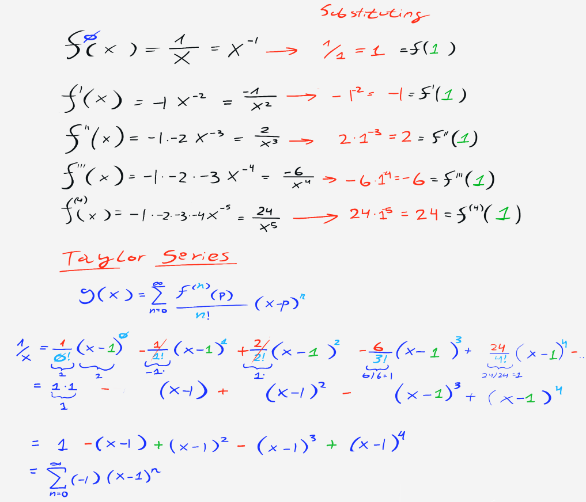

<video src="multivariate_calculus.assets/oneoverx-taylor-series.mp4"></video>
**This can tell us things about the power series more generally**

1. The approximation ignores the asymptote, going straight across it
   *  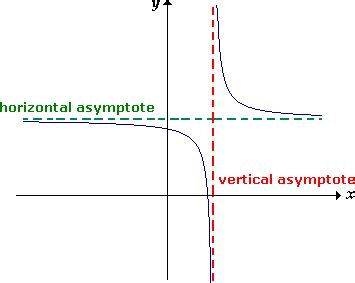
2. The approximations does dot describe at all the regions where $x < 0$
3.  The function is gradually improving for larger values of $x$ as we increase $n$ however, for values gather then around five, the function doesn't change as much, not describing larger values of $x$ and its tail flips up and down as the sign of each additional term flips the function from positive to negative and back again


# Linearisation

Re-framing the *Taylor Series* concepts to show things like the **expected error** in an approximation

 


*Adding higher power terms* **=** *improved approximation*


## Change in notation

### Changing the **first-order approximation** (example)


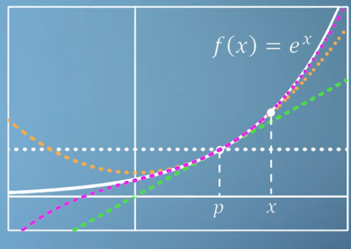

> **The expression says:** starting from the *height* $f(p)$ as you move away from $p$ your corresponding change in height is equals to your *distance away from $p$* **times** *the gradient of your function at $p$*


 

The approximation will be used to evaluate the function **near $p$** as you must already know about it at $p$

Now, the distance from $x$ to $p$, called $(x - p)$ will now be called $\Delta p$, meaning a  *small step size from $x$ to $p$*

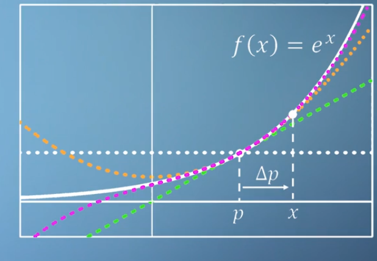

$x$ can now be expressed in terms of $p$


Now
$$
x = (p + \Delta p)
$$
Now, without $x$, we will put it back 🤔, just by swapping $p$ for $x$ - because $x$ is more commonly used and swapping it will make no difference in this case because everything is is terms of $p$

 

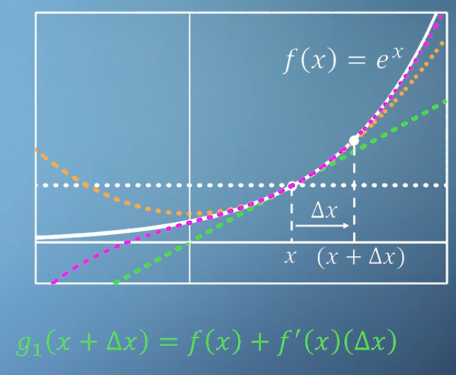


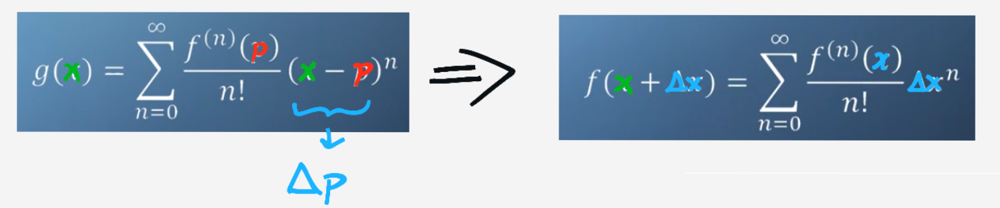

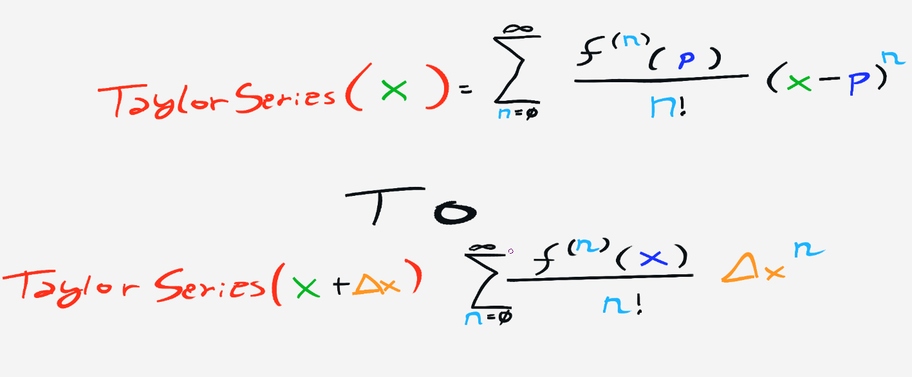


When using the first order approximation, instead of evaluating the base function, *how big should i expect the error to be*?


The gap between the green and other lines grows as we get away from the point  $x$


Thinking about the series: 

1. If $\Delta x$ is a small number, $\Delta x²$ should be really small and $\Delta x^3$ even smaller
2. If the infinite series can **exactly** describe the function
3. Although we couldn't evaluate all of the sums, the first chain that we ignore when making a first order approximation is multiplied by $\Delta x²$ 
4. Therefore, the error must be in the order of $\Delta x²$


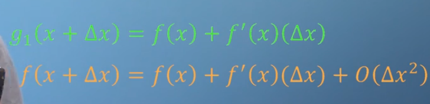

So, we can add to our first order approximation an error term


**This process of taking a function and ignoring terms above $\Delta x$ is called linearisation** - we took a potentially very nasty function and approximated it with just a straight line


Note that


The rise over run approximation and the first-order Taylor Series are the tangent line that goes trough the point $x$

In the rise over run approach we used two points to graph a straight line. As the points become closer, the line becomes a better and better approximation for the slope at that point, when the points are indistinguishably close, we say that the line became a tangent, and that it's slope is the same as the slope of the function at that point 

TL;DR

*As $\Delta x$ becomes closer to zero, the approximation for the function's slope becomes exact*


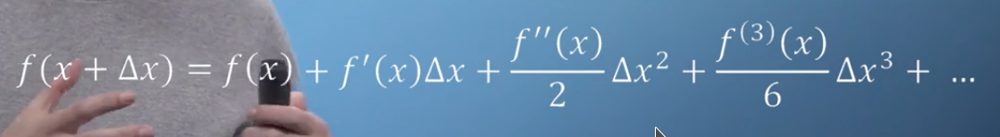


**But, what if... they don't**

If the point's don't come closer, $\Delta x$ is not fully tending towards zero, there is finite amount of space between the points

So, the resultant line - the gradient - will have a certain amount of error


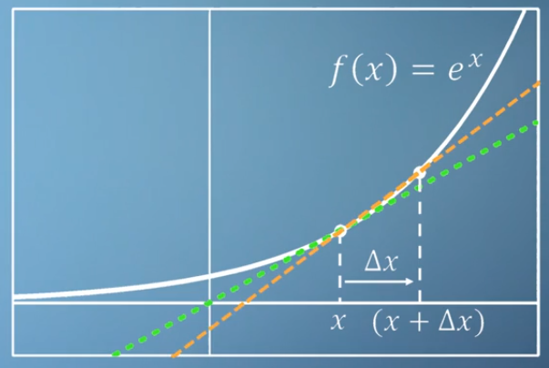

Then, it is possible to rearrange the Taylor Series to indicate how big we expect that error to be


The gradient term has been isolated to the left hand side of the expression, the result is exactly the same, but the isolated part is suspiciously similar to the rise over run expression *plus* a collection of higher order terms

If we remove everything except for that first term and add the error expression


The expected error is proportional to the distance between the two points

The method is *first order accurate*

This is particularly useful to make computer programs that solve these types of programs **numerically** rather then **analytically**


# Multivariate Taylor Series

## Recap


 

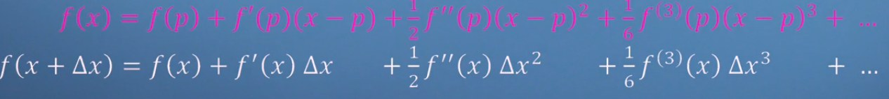


## Two-dimensional case

 


**$f$ is now a function of two variables $x$ and $y$**

The truncated Taylor Series expressions will enable us to approximate the function at some point nearby $(x, y)$

In the 2-D case, the approximation function should always be 2-D


### Zeroth order approximation

It was a straight line with no gradient in 1-D, now it is a straight **plane** with no gradient


### First order approximation

From the 1-D case, it should be something with a *height* and a *gradient*. In 2-D it still is a straight surface, but that time, it can have an *angle*

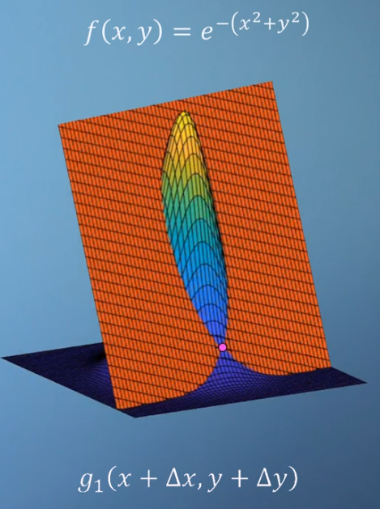

### Second order approximation

In the 1-D analogy it has *height*, *angle* and a single parabolic *curvature* - now, we're expecting some kind of *parabolic* surface

Using the *peak* as our approximation point, the parabola is created inside the curve  

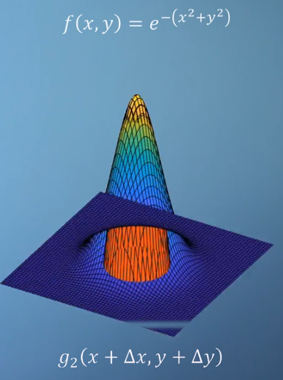

Choosing a point on the lateral face of the curve we got a *saddle function*


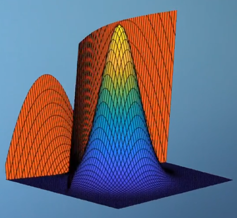

 ## Expression

### First order approximation


### Second order approximation

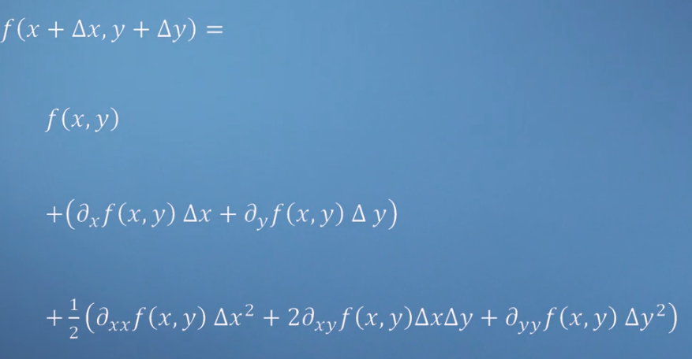


**Using the Jacobian**


**Using the Hessian**


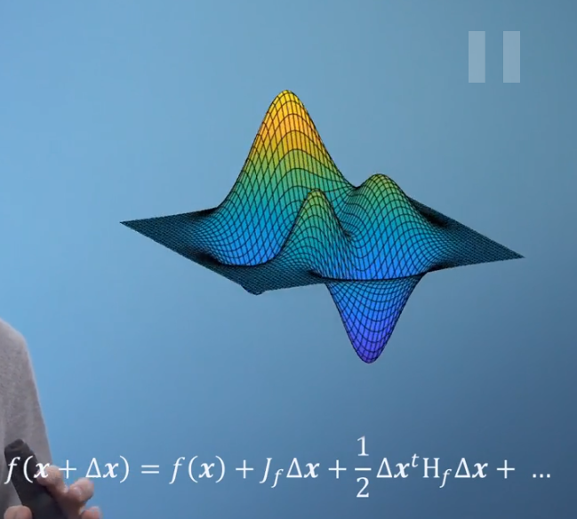

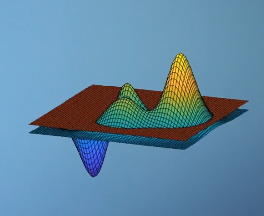


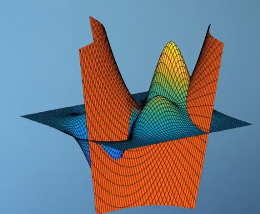

**This can be generalized for even higher dimension curves (hyper-curves)**


# Newton-Raphson method

Let's say that we have a distribution of heights

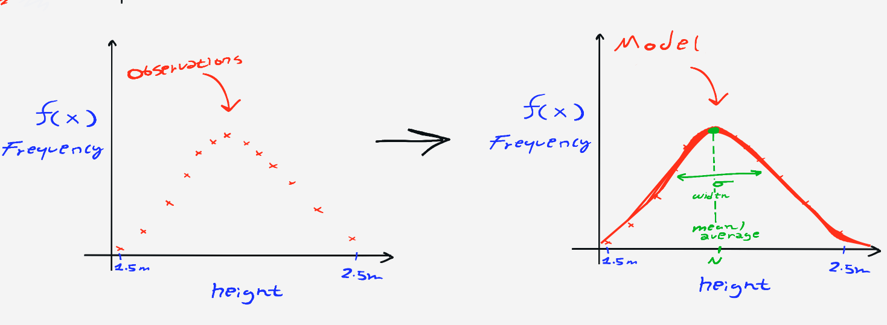


And we want to fit that data to some equation, them we could:

* Carry just the model instead of the entire dataset - we instead just have a model with two parameters
* Faster and simpler to do a lot of operations
* We could make predictions


But, **how to find the right parameters for the model** - the best $\mu$ and $\sigma$ we can?

We will need an **expression** that indicates *how good the model fits the data* and look how that goodness of fit varies as we change the parameters $\mu$ and $\sigma$


**Example for a simpler case:**


Let's say that we have a function that describes *how far away are we from the best value* for a certain parameter, $0$ means perfect fit, positive values that the model's predictions are too large, and negative values that the model is predicting too low values - in this case we want to find the **roots** of the function right away.

Or maybe just the *value $f(x)$ itself says how good our fit is*. In this case, we want to find *peaks and troughs* in o our function. Turns out that the **roots of the first derivative** lays on the same $x$ as those peaks and troughs. So, we could *take the first derivative* and finds the **roots** of it.

If we depend on *multiple variables*, let's say that we are solving the function as a **partial derivative**, that considers only one variable of interest at a time.

The **Newton-Raphson method** allows us to take the *derivative of a function* at some points and *converge* to some of it's **roots**. The process is:

1. Make a guess of where a root might be
2. Take the *slope* at that point 
3. *Extrapolate* the line of the *slope* until it reaches the *$x$ axis*, this will be your next guess
4. Repeat steps 2 and 3 until convergence

The formula for the *new guess* (step 3) is:


$$
x_{i+1} = x_i - \frac{f(x_i)}{f'(x_i)}
$$
Where the new guess $x_{i+1}$ depends on the last guess $x_i$

We are actually saying that the function is a *straight line* and then **guessing** that the *root is where the line crosses the $x$ axis* - we hope to find a pretty good approximation to the real root by repeating this process over and over. 

Example - let's use the following expression:
$$
f(x) = x³ - 5x² + 3x
$$
It its plotted as:


Rather then this simple function, that we can easily plot, it could:

* Be much more *complexer*  to solve e.g. you don't have enough computer resources to graph it on every point
* Have so much *dimensions* that we *couldn't even graph it*  at all

So, with this method we don't need to:

* Calculate $f(x)$ for a lot of points and plot the result (to solve it *analytically*)
  * The function could have multiple dimensions, so we wouldn't manage to graph it at all
* Solve it *algebraically* ($f(x) = 0 $)


**Python implementation and execution:**

```python
# Messy definition of linear, quadratic and cubic functions
def cubic_function(a=0, b=0, c=0, d=0):
    return lambda x : (a * pow(x, 3)) + (b * pow(x, 2)) + (c * x) + d

def quadratic_function(a=0, b=0, c=0):
    return cubic_function(0, a, b, c)

def linear_function(a=0, b=0):
    return quadradic_function(0, 0, a, b)


# The derivative on a point for any function (smaller values of h means more precision)
def derivative(function, x, h=0.00001):
    '''
       lim    f(x + h) - f(x)
       h->0   ---------------
                    h 
    '''
    return (function(x + h) - function(x)) / h

def evaluate_guess(function, guess_x):
    '''
    The distance between a f(guess) and 0
    '''
    return abs( 0 - function(guess_x) ) # the distance from f(x) and x=0

def newthon_raphson_step(function, guess_x=0):
    '''
    If you want to find the roots for a function f(x) numerically, the Newton-Raphson's method says

    1. Choose an initial guess x0
    2. Calculate new guesses until convergence with

          			    f(x_n)
        x_n+1 = x_n	- ---------
        			   f'(x_n)	

    '''
    return guess_x - (function(guess_x) / derivative(function, guess_x) )


def newthon_raphson(function, x_0=0, precision=0.000001, max_iterations=1000):
    '''
    The execution of multiple steps of the Newthon-Raphson's method, it will repeat until the distance between the guess
    and x=0 is grather then 0.000001 or if this value isn't reached after 1000 iterations - we'll assume that the function
    is stuck, however, we aren't actively checking for that
    '''
    best_guess_x = x_0
    Δ = evaluate_guess(function, x_0)
    iteration = 0

    print(f'#0 iter | x={best_guess_x} | Δ={Δ} | f(x)={function(best_guess_x)}')

    while best_guess_x is not None and Δ > precision and iteration < max_iterations:
        iteration += 1

        best_guess_x = newthon_raphson_step(function, best_guess_x)
        Δ = evaluate_guess(function, best_guess_x)

        print(f'#{iteration} iter | x = {round(best_guess_x, 6):.6f} | f(x) = {round(function(best_guess_x), 6):.6f} | Δ = {round(Δ, 6):.6f}')

    print('\n')
    print('== Newthon-Raphson final result ==')
    print(f'Root found:             {evaluate_guess(function, best_guess_x) < precision}')
    print(f'Iterations:             {iteration}')
    print(f'Starting guess:         x = {x_0}')
    print(f'Best guess:             x = {round(best_guess_x, 10):.10f}')
    print(f'Solving for best guess: f({round(best_guess_x, 2):.2f}) = {round(best_guess_x, 10):.10f}')
    print(f'Error:                  Δ = {round(Δ, 10):.10f}')
    print('====================================')

    if iteration == max_iterations:
        print('''Maximum iterations reached - probably you reached a close loop, check for loops, try changing x_0 or increase the maximum iteration amount.''')
    return best_guess_x, Δ, iteration

        
'''
a=1, b=-5 c=3
'''
#f = (pow(x, 3)) - (5 * pow(x, 2)) + (3 * x) # alternative

f = cubic_function(a=1, b=-5, c=3) # f(x) = x³ - 5x² + 3x
newthon_raphson(f, 10)
newthon_raphson(f, -10)
newthon_raphson(f, 2.15)
```


The function has roots as `x = 0 | x = 0.7 | x = 4.3`

**First guess**: `x=10` we find a root at `x=4.3` after `7` iterations

```tex
#0 iter | x=10 Δ=530 f(x)=530
#1 iter | x = 7.389166 | f(x) = 152.615401 | Δ = 152.615401
#2 iter | x = 5.746512 | f(x) = 41.891150 | Δ = 41.891150
#3 iter | x = 4.807295 | f(x) = 9.968451 | Δ = 9.968451
#4 iter | x = 4.396350 | f(x) = 1.521767 | Δ = 1.521767
#5 iter | x = 4.306941 | f(x) = 0.064756 | Δ = 0.064756
#6 iter | x = 4.302784 | f(x) = 0.000137 | Δ = 0.000137
#7 iter | x = 4.302776 | f(x) = 0.000000 | Δ = 0.000000

== Newthon-Raphson final result ==
Root found:             True
Iterations:             7
Starting guess:         x = 10
Best guess:             x = 4.3027756378
Solving for best guess: f(4.30) = 4.3027756378
Error:                  Δ = 0.0000000013
====================================
```

**Second guess**: `x=-10` and we find the root at `x=0` after `10` iterations

```
#0 iter | x=-10 Δ=1530 f(x)=-1530
#1 iter | x = -6.203471 | f(x) = -449.754112 | Δ = 449.754112
#2 iter | x = -3.711532 | f(x) = -131.140034 | Δ = 131.140034
#3 iter | x = -2.101297 | f(x) = -37.659314 | Δ = 37.659314
#4 iter | x = -1.090559 | f(x) = -10.515290 | Δ = 10.515290
#5 iter | x = -0.488772 | f(x) = -2.777577 | Δ = 2.777577
#6 iter | x = -0.165962 | f(x) = -0.640173 | Δ = 0.640173
#7 iter | x = -0.030967 | f(x) = -0.097724 | Δ = 0.097724
#8 iter | x = -0.001465 | f(x) = -0.004405 | Δ = 0.004405
#9 iter | x = -0.000004 | f(x) = -0.000011 | Δ = 0.000011
#10 iter | x = 0.000000 | f(x) = 0.000000 | Δ = 0.000000

== Newthon-Raphson final result ==
Root found:             True
Iterations:             10
Starting guess:         x = -10
Best guess:             x = 0.0000000000
Solving for best guess: f(0.00) = 0.0000000000
Error:                  Δ = 0.0000000001
====================================
```

**Third guess**: 

We already know the roots `4.3` and `0`, our function is cubic, so it might have three roots

Some guesses could be:  `x < 10`, `x > 10` or `x between 0 and 4.3`  Running the method with really large or really small values will return the already know roots - a good guess could be at the middle of the known roots, at `x=2.15`.

For the guess  `x=2.15` we find a root at  `x=0.697` after `3` iterations

```
#0 iter | x=2.15 Δ=6.724124 f(x)=-6.724124
#1 iter | x = 0.698484 | f(x) = -0.003172 | Δ = 0.003172
#2 iter | x = 0.697226 | f(x) = -0.000005 | Δ = 0.000005
#3 iter | x = 0.697224 | f(x) = -0.000000 | Δ = 0.000000

== Newthon-Raphson final result ==
Root found:             True
Iterations:             3
Starting guess:         x = 2.15
Best guess:             x = 0.6972243623
Solving for best guess: f(0.70) = 0.6972243623
Error:                  Δ = 0.0000000001
====================================
```


**However, some thing might go wrong**. some guess could put us in a closed loop, going back and forth between the same values, never getting closer tho the answer


In this example, the initial guess is $x=0$, the calculated new guess lead us to $x=1$, evaluating that results in $x=0$ again, so we would cycle on it forever


**Running**

```python
f = cubic_function(a=1, b=0, c=-2, d=2) # x³ -2x + 2
newthon_raphson(f, 0)
```

results in

```
#0 iter | x=0 | Δ=2 | f(x)=2
#1 iter | x = 1.000000 | f(x) = 1.000000 | Δ = 1.000000
#2 iter | x = 0.000030 | f(x) = 1.999940 | Δ = 1.999940
#3 iter | x = 1.000000 | f(x) = 1.000000 | Δ = 1.000000
#4 iter | x = 0.000030 | f(x) = 1.999940 | Δ = 1.999940
#5 iter | x = 1.000000 | f(x) = 1.000000 | Δ = 1.000000
#6 iter | x = 0.000030 | f(x) = 1.999940 | Δ = 1.999940
#7 iter | x = 1.000000 | f(x) = 1.000000 | Δ = 1.000000
...
#995 iter | x = 1.000000 | f(x) = 1.000000 | Δ = 1.000000
#996 iter | x = 0.000030 | f(x) = 1.999940 | Δ = 1.999940
#997 iter | x = 1.000000 | f(x) = 1.000000 | Δ = 1.000000
#998 iter | x = 0.000030 | f(x) = 1.999940 | Δ = 1.999940
#999 iter | x = 1.000000 | f(x) = 1.000000 | Δ = 1.000000
#1000 iter | x = 0.000030 | f(x) = 1.999940 | Δ = 1.999940


== Newthon-Raphson final result ==
Root found:             False
Iterations:             1000
Starting guess:         x = 0
Best guess:             x = 0.0000300103
Solving for best guess: f(0.00) = 0.0000300103
Error:                  Δ = 1.9999399794
====================================
Maximum iterations reached - probably you reached a close loop, check for loops, try changing x_0 or increase the maximum iteration amount.
```


**Other problem**

When you're close to a ==turning point==, either a *minimum* or a *maximum*, the gradient will be very *small* that when you divide by it the new guess might return you a crazy value, therefore, it wont converge, just trow you somewhere else.


 

**Example**:

Using our already known function

```python
f = cubic_function(a=1, b=-5, c=3) # f(x) = x³ - 5x² + 3x
newthon_raphson(f, 3)
```

If our first guess is $x=3$ the first iteration will trow us at $x = 224999.9...$

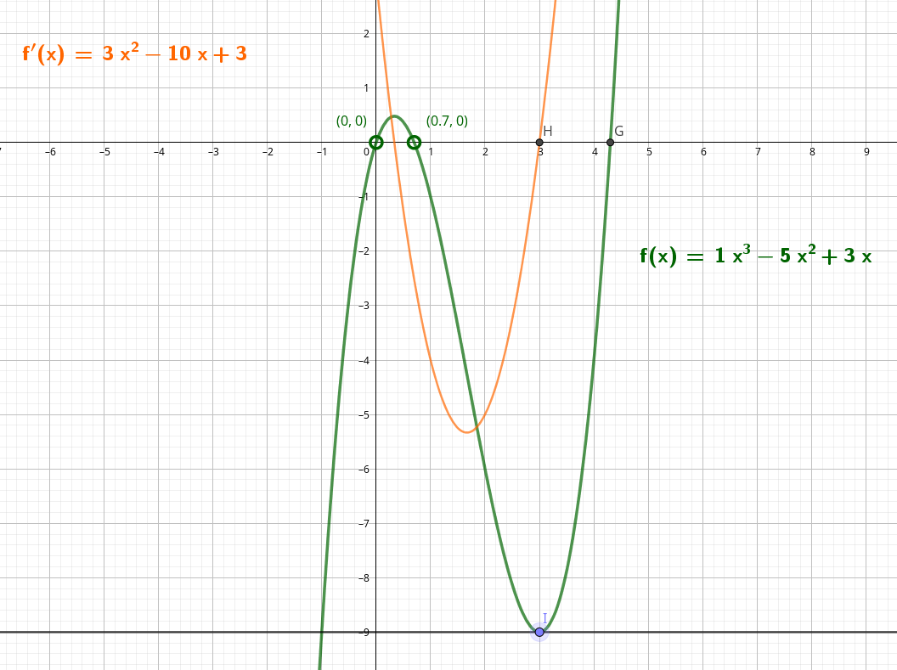

The gradient at this point is $0$

```
#0 iter | x=3 | Δ=9 | f(x)=-9
#1 iter | x = 224999.983822 | f(x) = 11390369418629708.000000 | Δ = 11390369418629708.000000
#2 iter | x = 150000.382718 | f(x) = 3374913333419859.500000 | Δ = 3374913333419859.500000
#3 iter | x = 100000.740748 | f(x) = 999972222170842.250000 | Δ = 999972222170842.250000
#4 iter | x = 66667.736126 | f(x) = 296288333250360.375000 | Δ = 296288333250360.375000
#5 iter | x = 44445.711830 | f(x) = 87789128875373.984375 | Δ = 87789128875373.984375
#6 iter | x = 29631.036208 | f(x) = 26011609715097.308594 | Δ = 26011609715097.308594
#7 iter | x = 19754.579076 | f(x) = 7707142837706.546875 | Δ = 7707142837706.546875
#8 iter | x = 13170.274868 | f(x) = 2283597801325.270020 | Δ = 2283597801325.270020
#9 iter | x = 8780.738876 | f(x) = 676621562090.689331 | Δ = 676621562090.689331
#10 iter | x = 5854.381602 | f(x) = 200480458823.617523 | Δ = 200480458823.617523
#11 iter | x = 3903.476773 | f(x) = 59401612691.887161 | Δ = 59401612691.887161
#12 iter | x = 2602.873752 | f(x) = 17600477174.935402 | Δ = 17600477174.935402
#13 iter | x = 1735.805199 | f(x) = 5214955351.280502 | Δ = 5214955351.280502
#14 iter | x = 1157.759699 | f(x) = 1545171242.574341 | Δ = 1545171242.574341
#15 iter | x = 772.396381 | f(x) = 457828058.790962 | Δ = 457828058.790962
#16 iter | x = 515.488020 | f(x) = 135652455.080934 | Δ = 135652455.080934
#17 iter | x = 344.216550 | f(x) = 40193116.884430 | Δ = 40193116.884430
#18 iter | x = 230.036731 | f(x) = 11908935.709860 | Δ = 11908935.709860
#19 iter | x = 153.918597 | f(x) = 3528482.455130 | Δ = 3528482.455130
#20 iter | x = 103.175803 | f(x) = 1045415.127232 | Δ = 1045415.127232
#21 iter | x = 69.351243 | f(x) = 309711.463050 | Δ = 309711.463050
#22 iter | x = 46.807548 | f(x) = 91738.526207 | Δ = 91738.526207
#23 iter | x = 31.787566 | f(x) = 27162.842722 | Δ = 27162.842722
#24 iter | x = 21.788263 | f(x) = 8035.229690 | Δ = 8035.229690
#25 iter | x = 15.143750 | f(x) = 2371.729702 | Δ = 2371.729702
#26 iter | x = 10.748096 | f(x) = 696.273432 | Δ = 696.273432
#27 iter | x = 7.871932 | f(x) = 201.581722 | Δ = 201.581722
#28 iter | x = 6.042412 | f(x) = 56.186449 | Δ = 56.186449
#29 iter | x = 4.964147 | f(x) = 14.008927 | Δ = 14.008927
#30 iter | x = 4.450753 | f(x) = 2.472117 | Δ = 2.472117
#31 iter | x = 4.312801 | f(x) = 0.156335 | Δ = 0.156335
#32 iter | x = 4.302827 | f(x) = 0.000790 | Δ = 0.000790
#33 iter | x = 4.302776 | f(x) = 0.000000 | Δ = 0.000000


== Newthon-Raphson final result ==
Root found:             True
Iterations:             33
Starting guess:         x = 3
Best guess:             x = 4.3027756393
Solving for best guess: f(4.30) = 4.3027756393
Error:                  Δ = 0.0000000245
====================================
```

Changing to $x_0=3.1$ we got:

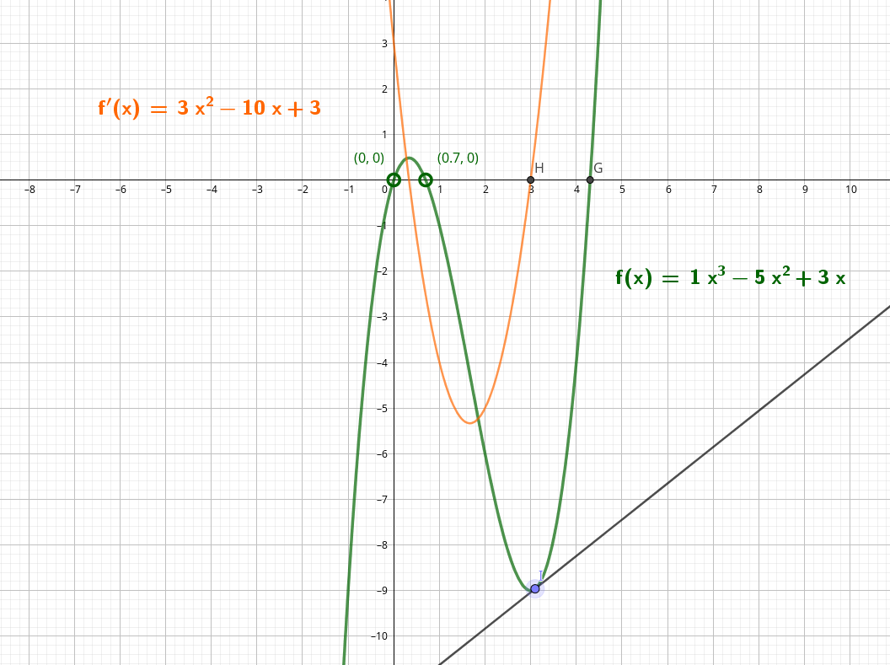

```
#0 iter | x=3.1 | Δ=8.959 | f(x)=-8.959
#1 iter | x = 13.893417 | f(x) = 1758.350053 | Δ = 1758.350053
#2 iter | x = 9.925548 | f(x) = 515.024498 | Δ = 515.024498
#3 iter | x = 7.341307 | f(x) = 148.208208 | Δ = 148.208208
#4 iter | x = 5.717490 | f(x) = 40.607005 | Δ = 40.607005
#5 iter | x = 4.792381 | f(x) = 9.608784 | Δ = 9.608784
#6 iter | x = 4.391632 | f(x) = 1.441647 | Δ = 1.441647
#7 iter | x = 4.306544 | f(x) = 0.058577 | Δ = 0.058577
#8 iter | x = 4.302783 | f(x) = 0.000112 | Δ = 0.000112
#9 iter | x = 4.302776 | f(x) = 0.000000 | Δ = 0.000000


== Newthon-Raphson final result ==
Root found:             True
Iterations:             9
Starting guess:         x = 3.1
Best guess:             x = 4.3027756378
Solving for best guess: f(4.30) = 4.3027756378
Error:                  Δ = 0.0000000010
====================================
```

We end up using less then a third of iterations to reach the same result


**Bonus**: simple polynomial printer

```python
# works for the simple cases
def simple_polynomial_to_str(*args):
    
    def power(of): # qyuck and dirty way
        if of == 2: return '²'  # to represent a²
        if of == 3: return '³'  # to represent a³
        if of == 4: return '⁴'  # to represent a⁴
        if of == 1: return ''   # to represent a¹ = a
        else: return f'^{of}'   # to represent a^n e.g. a^-10

    def multiplier(value):
        if value == 1: return '' # 1*x = x
        if value == -1: return '-' # -1*x = -x
        else: return value

    terms = []
    for index, item in enumerate(args):
        if item != 0:
            if index != len(args) - 1:
                terms.append(f'{multiplier(item)}x{power(len(args) - (index + 1) )}')
            else:
                terms.append(f'{multiplier(item)}') # the last item (n) is n * x⁰, that's the same as just n
    return '+'.join(terms).replace('+-', '-').replace('+', ' + ').replace('-', ' - ')

print(simple_polynomial_to_str(1, -3, 1, 0, -2, 10))

# x^5 - 3x⁴ + x³ - 2x + 2
```


# Gradient descent


## Gradient?


> *This class is a bit confusing at first look, maybe you want to look at some other references **first*** 
>
> **Recommendations** below

<iframe width="100%" height="500" src="https://www.youtube.com/embed/IHZwWFHWa-w" frameborder="0" allow="accelerometer; autoplay; encrypted-media; gyroscope; picture-in-picture" allowfullscreen></iframe>


<iframe width="100%" height="500" src="https://www.youtube.com/embed/xnpdvvCNJEE" frameborder="0" allow="accelerometer; autoplay; encrypted-media; gyroscope; picture-in-picture" allowfullscreen></iframe>
> We've already learn that we can use the *derivatives* to measure the *slope* of a function at some point and that we could use that slope to navigate to lower or upper points in our function
>
> We used the **Newton-Raphson method** to find the *roots* of a certain *one-dimensional* function **numerically**
>
> In some scenarios we have a function that says *how good  or bad our model fits some data* in this case, we may want to find **troughs** in that function if this means to *reduce our model's badness* in fitting
>
> In a **multivariate** space, the *derivative at a point* isn't enough:
>
> *  With 1-D plots, the slope indicated by a *scalar* can define how steep the function is at that point
> * However, in a multivariate case, let's say, 2-D: ==the slope of the function depends on which direction you're looking at==
>   * Which line is the slope of the function?
>   * 
>
> 
>
> The solution is using a **vector** instead. A vector is composed by:
>
> * Starting point
> * Direction
> * Magnitude
>
> This vector is called **Grad** and it's represented by $\nabla f(a, b, ...)$ as the grad of $f$ at some point $a, b, ...$
>
> * $\nabla$ properties:
>   * Points towards the *steepest* slope at a point - the direction in which the ==function will increase the fastest==
>     * This means that we can walk towards $-\nabla$ to get down the hill
>   * Has a **magnitude** of the *slope* at that point
>
>   
>
> For real problems - *specially training neural networks* - we need to find the **troughs** and **peaks** of **a lot** of ==multivariate== functions **a lot** of times
>
> * Solving it algebraically is just not feasible - we need a solution that helps us to *navigate trough that multivariate space*, generally trying to minimize that function by *walking down the hill*  using some **numerical method**
> * If we land at some random point in a function, we want to:
>   1.  Analyze *how steep the hill is* around us
>   2. Pick the direction where the hill is the *steepest*
>   3. Find which *direction is downwards* 
>   4.  Walk in that direction *some amount of steps* that makes sense i.e. we don't want to land somewhere totally unknown 

 

Let's start by looking at the function
$$
f(x, y) = x²*y
$$


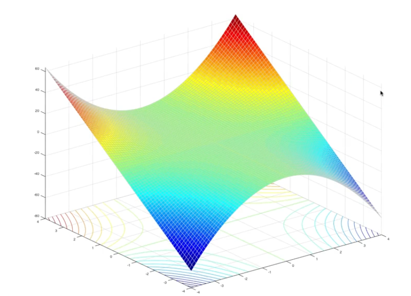


Note that the function gets **bigger** when $x$ is larger and $y$ is positive and it gets **smaller** whenever $y$ gets negative

Spinning and looking down the $y$ axis we got a projection of a *straight line*

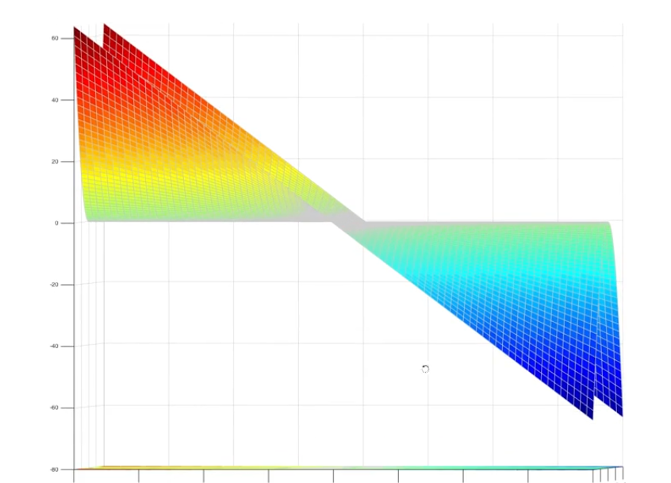

Spinning and looking to the $x$ axis we got an **upward parabola for $y>0$** and an **downward parabola for $y<0$**

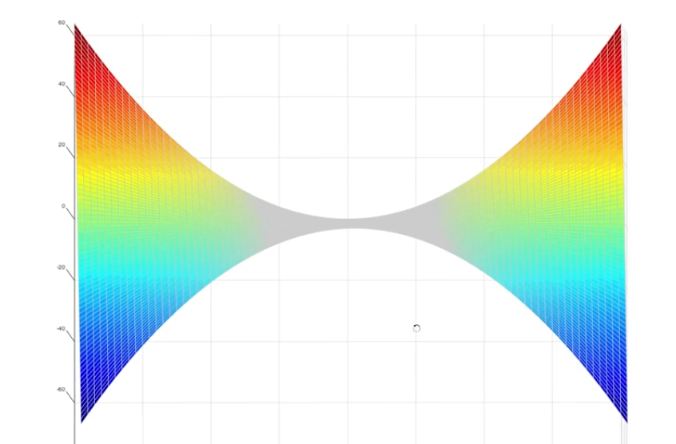


And the function is equal to zero along both axis


The question is: *how do i find the fastest or steepest way to get down in this graph?*

We can find the **gradient** of the function in respect to **each of its axis** - we could *differentiate* $f(x, y)$ for each variable by ==treating everything else as constants==

**Grad** is a awesome vector - it's the thing that connects *calculus* to *linear algebra*


The Grad vector is defined as:
$$
\nabla f(a, b, ...) = \begin{bmatrix} \frac{df}{dx}(a, b, \cdots) \\ \frac{df}{dy}(a, b, \cdots) \\ \cdots \end{bmatrix}
$$
In this case:


$$
\frac{\partial f}{\partial x} = 2xy
\\
and
\\
\frac{\partial f}{\partial y} = x²
$$
Therefore
$$
\nabla f = \begin{bmatrix} \frac{df}{dx}(a, b) \\ \frac{df}{dy}(a, b) \end{bmatrix}
\\
\nabla f(x, y) = \begin{bmatrix} 2xy \\ x² \end{bmatrix}
$$


> We thing about grad as the **combination of two vectors**, the first is
>
> Both start from some given point
> $$
> P = (x, y,z)
> \\
> P=(x, y, f(x,y))
> $$
> Let's ignore $z$
>
> The partial derivative in respect to $x$ at $P$
> $$
> Gradient_x = \begin{bmatrix} \frac{\partial f}{\partial x}(a, b) \\ 0\end{bmatrix}
> $$
> $Gradient_x + P$ will result in a vector that starts from $P$ and goes in the $x$ direction an amount corresponding to the **slope** in $x$ direction at that point
>
> The second vector is
>
> The partial derivative in respect to $y$ at some $P$ 
> $$
> Gradient_y = \begin{bmatrix} 0 \\ \frac{\partial f}{\partial y}(a, b) \end{bmatrix}
> $$
> $Gradient_y + P$ will result in a vector that starts from $P$ and goes in the $x$ direction an amount corresponding to the **slope** in $x$ direction at that point
>
> 
>
> 
>
> Then
> $$
> \nabla = Gradient_x + Gradient_y
> \\
> \nabla = \begin{bmatrix} \frac{\partial f}{\partial x}(a, b) \\ 0\end{bmatrix} + \begin{bmatrix} 0 \\ \frac{\partial f}{\partial y}(a, b) \end{bmatrix} = \begin{bmatrix} \frac{\partial f}{\partial x}(a, b) \\ \frac{\partial f}{\partial y}(a, b)\end{bmatrix}
> $$
> So, if we sum it with $P$, the resultant will be a *vector* that starts at $P$and points towards the *steepest hill* around $P$ by a direction proportional to the *steepness* of the hill
>
> 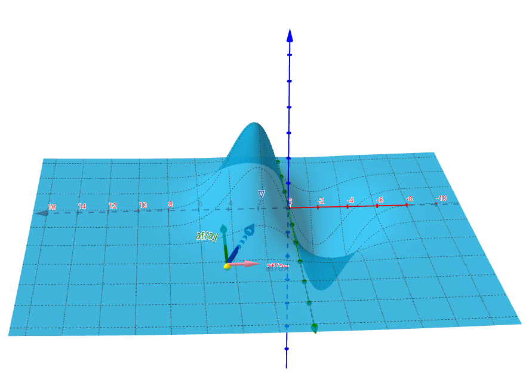
> $$
>  \nabla = P + \begin{bmatrix} \frac{\partial f}{\partial x}(a, b) \\ \frac{\partial f}{\partial y}(a, b)\end{bmatrix}
> $$
> 


<video src="multivariate_calculus.assets/grad.mp4"></video>


The vector $\nabla$ comes in handy because once we calculated it, we can calculate the derivative in any direction by multiplying it with some unit vector


$$
\hat{r}=\begin{bmatrix} c \\ d\end{bmatrix}
$$

$$
\nabla f = \begin{bmatrix} \frac{df}{dx}(a, b) \\ \frac{df}{dy}(a, b) \end{bmatrix} \cdot \begin{bmatrix} c \\ d\end{bmatrix}
$$

$$
df = \frac{\partial f}{\partial x}c + \frac{\partial f}{\partial y}d 
$$


* $\nabla$ is aways perpendicular ($90°$) from the contour lines on a contour map

$$
c² + d² = 1
$$


## Descent?

OK, now we know the *direction* we want to go: $-\nabla$, but, **by how much should we walk**

* Walk too much and we might go over the valley
* Walk too little and the amount of calculations becomes very expensive

Turns out that $\nabla$ can help us with that problem too

If we begin at some point $S_0$

We will take **small steps** corresponding with the *slope of the hill*
$$
S_{n+1} = S_n - γ * \nabla f(S_n)
$$

* If we overshoot, the direction of $\nabla$ will points us to the right direction
* As we get closer to a turning point, $\nabla$ will become smaller and also our steps


