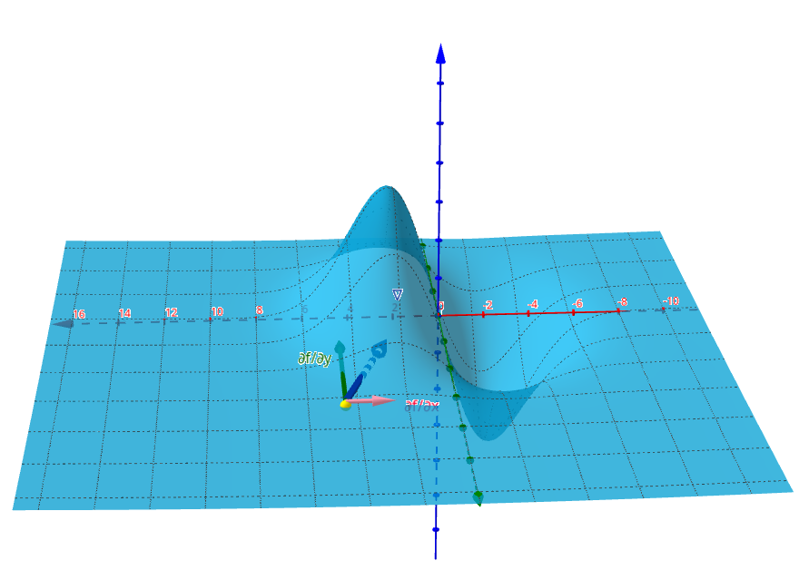

# machine_learning_basics_notes

Notes about machine learning basics (at least for now...).

In markdown (edited on [Typora](https://typora.io/), so you may have some issues if you're (or me from the future) using other editor).

Eventually converted to html...

**Page on GitHub Pages**: https://alrestevam.github.io/machine-learning-basics-notes/ (GH pages isn't rendering the pages correctly).

Some code examples in:

* GeoGebra
* Python

## Topics

### HTML Page
1. [Linear Algebra](./1_linear_algebra/linear-algebra.md.html)
2. [Multivariate Calculus](./2_multivariate_calculus/multivariate_calculus.md.html)

### GitHub parsed Markdown
1. [Linear Algebra](https://github.com/ALREstevam/machine-learning-basics-notes/blob/master/1_linear_algebra/linear-algebra.md)
2. [Multivariate Calculus](https://github.com/ALREstevam/machine-learning-basics-notes/blob/master/2_multivariate_calculus/multivariate_calculus.md)
